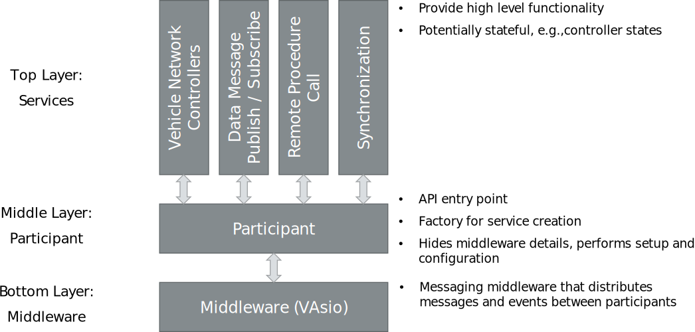

=============================
Developer Guide
=============================

.. |ProductName| replace:: SIL Kit

The following sections explain, how to consume the Vector |ProductName| library in your own application and how to use the |ProductName| API to communicate with other participants of a simulation.

.. contents::
   :local:
   :depth: 2

Getting the |ProductName|
--------------------------

Precompiled |ProductName| packages are regularly released on GitHub (`https://github.com/vectorgrp/sil-kit/releases <https://github.com/vectorgrp/sil-kit/releases>`_).
If you need to build the library yourself, take a look at the readme file of the repository's root folder.

Architecture
------------

The |ProductName| implements a layered architecture:

|
|

Writing your first |ProductName| application
--------------------------------------------

This tutorial assumes that you are familiar with `CMake (https://cmake.org) <https://cmake.org>`_ and C++.

Using the |ProductName| package
~~~~~~~~~~~~~~~~~~~~~~~~~~~~~~~

The |ProductName| distribution contains a self-contained and deployable installation in the *SilKit* directory.
The CMake build configuration required is exported to ``SilKit/lib/cmake/SilKit`` and defines the ``SilKit::SilKit`` target.

From CMake this can be consumed via the ``find_package(SilKit CONFIG)`` mechanism.
For example, the following CMakeLists.txt imports the |ProductName| library based on its file system path.

.. literalinclude::
   ../usage/sample_silkit/CMakeLists.txt
   :language: cmake
   :lines: 22-31

Properties, like include directories and compile flags, are automatically handled by the imported target.
If you use another method to build your software you can directly use the ``SilKit/include`` and ``SilKit/lib`` directories for C++ headers and libraries.

.. _sec:developer-simple:

A simple Publish / Subscribe application
~~~~~~~~~~~~~~~~~~~~~~~~~~~~~~~~~~~~~~~~
We'll create a simple, self-contained |ProductName| application that uses :doc:`Publish/Subscribe<../api/pubsub>` to exchange user-defined data between two participants.
In our C++ file ``simple.cpp``, we include the headers and define namespaces and constants:

.. literalinclude::
   ../usage/sample_silkit/simple.cpp
   :language: cpp
   :lines: 22-31

|ProductName| participants are created with a configuration that is used to change certain aspects of the simulation without recompiling the application.

.. admonition:: Note

  |ProductName| applications should be able to run without a configuration file.
  However, applications should allow users to provide one in case they want to reconfigure the behavior of the application (see :ref:`The Participant Configuration File<sec:participant-config>` for details).

This can be done by loading an existing :ref:`YAML file<sec:sil-kit-config-yaml>`.
Here, we use the configuration file ``simple.yaml`` to configure a logger that logs all error messages to a file:

.. literalinclude::
   ../usage/sample_silkit/simple.yaml
   :language: yaml

We load it in the main function of our code::

    int main(int argc, char** argv)
    {
        auto config = SilKit::Config::ParticipantConfigurationFromFile("simple.yaml");
        // TODO: Use config to create participants
    }

The application will run two participants concurrently, each in its own thread.
One thread will act as a publisher by sending a test string to its subscribers:

.. literalinclude::
   ../usage/sample_silkit/simple.cpp
   :language: cpp
   :lines: 33-69

Initially, the simulation is joined by creating the participant called "PublisherParticipant".
This properly initializes the |ProductName| library; enables the instantiation of :doc:`Services<../api/api>` and offers access to the :doc:`Life Cycle Service<../api/lifecycleService>`, which controls the orchestration of our simulation.
Next, we create a :cpp:class:`publisher<SilKit::Services::PubSub::IDataPublisher>` for the ``DataService`` topic.
Later, we subscribe to the same topic name in our subscriber to enable communication between the participants.
The actual simulation is performed in the simulation task.
This is a callback that is executed by the |ProductName| runtime whenever the simulation time advances.
This callback has to be registered with the time synchronization service's :cpp:func:`SetSimulationStepHandler()<SilKit::Services::Orchestration::ITimeSyncService::SetSimulationStepHandler()>`.
We hand over the publisher object in the capture list of our simulation task and use it to send data through its :cpp:func:`Publish()<SilKit::Services::PubSub::IDataPublisher::Publish()>` method.

The subscriber runs in its own thread, too:

.. literalinclude::
   ../usage/sample_silkit/simple.cpp
   :language: cpp
   :lines: 71-102

The setup is similar to the publisher, except that we instantiate a :cpp:class:`subscriber<SilKit::Services::PubSub::IDataSubscriber>` interface.
This allows us to register a :cpp:func:`SetDataMessageHandler()<SilKit::Services::PubSub::IDataSubscriber::SetDataMessageHandler()>` callback to receive data value updates.
The simulation task has to be defined, even though no simulation work is performed.

We extend our main function to spawn both threads and join them again once finished.
Also, we use a try-catch block here to get proper error handling e.g., if the configuration file cannot be loaded.

.. literalinclude::
   ../usage/sample_silkit/simple.cpp
   :language: cpp
   :lines: 104-127

The application is built with CMake on the command line (from a build directory) by calling ``cmake ..`` to generate and then build via ``cmake --build .``.
A more convenient way is to open the folder in an IDE with CMake support.
To run this sample, copy the shared library files (e.g., on Windows the ``SilKit.dll``, ``SilKitd.dll`` from ``SilKit/bin``) and the ``simple.yaml`` next to the compiled executable.

Running the simulation
~~~~~~~~~~~~~~~~~~~~~~

Our sample needs the utility processes :ref:`sec:util-registry` and :ref:`sec:util-system-controller` to run.
The registry is required for participant discovery.
The :ref:`sec:util-system-controller` takes the participant names as command line arguments, initializes the connected participants and starts the simulation until the return key is pressed.
For convenience and to reduce code duplication, these utility programs are implemented in separate executables and distributed in binary forms.

The final simulation setup can be run through the following commands:

.. code-block::
      
      # Start the Middleware Registry
      ./sil-kit-registry.exe

      # Start the System Controller and tell it to wait for PublisherParticipant and SubscriberParticipant
      ./sil-kit-system-controller.exe PublisherParticipant SubscriberParticipant

      # Start the application running the two participants
      # Make sure that the SilKit.dll and simple.yaml are available 
      ./SampleSilKit.exe

The complete source code of this sample can be found here: :download:`CMakeLists.txt<../usage/sample_silkit/CMakeLists.txt>`
:download:`simple.cpp<../usage/sample_silkit/simple.cpp>` :download:`simple.yaml<../usage/sample_silkit/simple.yaml>`

