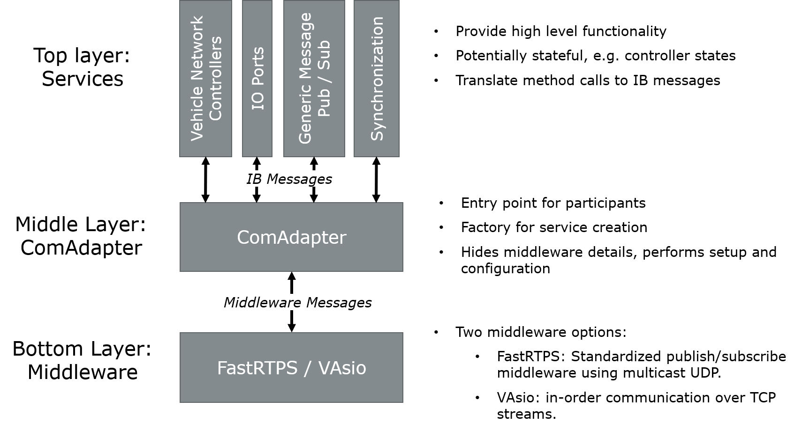

=============================================
Vector Integration Bus (VIB)
=============================================

The Vector Integration Bus is a runtime component that enables distributed simulation for
automotive applications. For this, the Vector Integration Bus provides:

* Communication on different abstraction levels including

  * Low level analog digital IO
  * Vehicle networks (CAN / CAN FD, Ethernet, FlexRay, LIN)
  * High level generic messages for arbitrary application specific communication

* Synchronization of simulation time implementing different protocols

  * Fixed tick rate with acknowledgement (Tick/TickDone)
  * Quantum based synchronization with variable quantum durations
  * Event based synchronization according to lower bound event time

* State handling to control and observe execution of the simulated system
* System configuration from a single JSON file to specify the simulated including communication
  and synchronization needs

For getting started developing with the Vector Integration Bus, see the :doc:`quickstart guide <usage/quickstart>`

.. _base-architecture:

VIB Architecture
----------------------------

The Vector Integration Bus implements a layered architecture comprising three layers:

Supported Services
------------------

The currently supported services of the VIB consist of the following categories:

* **IO Ports:** Analog IO, digital IO, Pattern IO and Pulse-width modulation (PWM) IO
* **Vehicle Network Controllers:** CAN / CAN FD, Ethernet, FlexRay and LIN
* **Generic Messages:** without any data type constraints

Vehicle Networks
~~~~~~~~~~~~~~~~

The VIB provides means to simulate CAN / CAN FD, Ethernet, FlexRay, and LIN networks.
All networks can be simulated with two different levels of detail: simple, functional simulation
or high detail, timing accurate simulation. Timing accurate simulation requires the Vector Network
Simulator, which is part of the :doc:`Vector Integration Bus Extensions (VIBEs) <../vibes/overview>`.

Vehicle Network Controllers
~~~~~~~~~~~~~~~~~~~~~~~~~~~

Applications access vehicle networks using matching controller models. While the
controller interfaces are the same for simple and high detail simulation, the Vector
Network Simulator VIBE requires controllers to be properly configured, initialized, and used
according to the corresponding network. Without the Network Simulator, on the other hand,
applications can directly send messages without initializing the controllers. As a result,
an application that works in the simple use case do not necessarily work when switching to
a high detail simulation using the Network Simulator. However, applications that have been tested
with Network Simulator, will also work without it. The CAN, LIN, Ethernet, and FlexRay demos 
provided with the VIB have all been tested both with and without the Network Simulator.

In Section :doc:`Vector Integration Bus Services <usage/services>` it is described how to configure and use
Vehicle Network Controllers and pointed out which differences for simple simulation and
high detail VIBE simulation with the Network Simulator exists. Furthermore, the usage of
the other services (IO, Generic Message, ...) will also be presented in detail.

VIB Prerequisites for Usage
---------------------------

* For Windows:
    * Visual Studio 2015 Toolset v140 and higher (also tested with MSVC++ 14.12)
* For Ubuntu Xenial (16.04 LTS):
    * GCC 5.4.0-6ubuntu1~16.04.10 **or**
    * Clang 3.8.0-2ubuntu4

These are the specific versions VIB is tested and built against.
