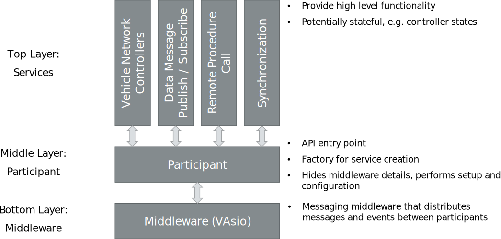

=============================================
Vector Integration Bus (VIB)
=============================================

.. admonition:: Warning:

   Currently, the Vector Integration Bus documentation is being reviewed and adapted to match the current state
   of the development. Sections with a leading "!!!" prefix in their title have not been reviewed so far and might
   me outdated.

The Vector Integration Bus is a runtime component that enables distributed simulation for
automotive applications. For this, the Vector Integration Bus provides:

* Communication on different abstraction levels including

  * Vehicle networks (CAN / CAN FD, Ethernet, FlexRay, LIN)
  * High level data messages for arbitrary application specific communication in a publish / subscribe pattern
  * Remote Procedure Calls for calling arbitrary procedures on remote participants

* Synchronization of simulation time implementing different protocols

  * Event based synchronization according to lower bound event time

* State handling to control and observe execution of the simulated system
* An optional participant configuration JSON/Yaml file to configure simulation participants behavior even after
  compile time

For getting started developing with the Vector Integration Bus, see the :doc:`quickstart guide <usage/quickstart>`.

.. _base-architecture:

Architecture
----------------------------

The Vector Integration Bus implements a layered architecture comprising three layers:

Supported Services
------------------

The currently supported services of the VIB consist of the following categories:

* **Vehicle Network Controllers:** CAN / CAN FD, Ethernet, FlexRay and LIN
* **Data Messages:** without any data type constraints
* **RPC Servers/Clients:** for remote procedure call functionality

Vehicle Networks
~~~~~~~~~~~~~~~~

The VIB provides means to simulate CAN / CAN FD, Ethernet, FlexRay, and LIN networks.
All networks can be simulated with two different levels of detail: simple, functional simulation
or high detail, timing accurate simulation. Timing accurate simulation requires the :doc:`Vector Network
Simulator <vibes/networksimulator>`, which is part of the :doc:`Vector Integration Bus Extensions (VIBEs) <vibes/overview>`.

Vehicle Network Controllers
~~~~~~~~~~~~~~~~~~~~~~~~~~~

Applications access vehicle networks using matching controller models. While the
controller interfaces are the same for simple and high detail simulation, the Vector
Network Simulator VIBE requires controllers to be properly configured, initialized, and used
according to the corresponding network. Without the Network Simulator, on the other hand,
applications can directly send messages without initializing the controllers. As a result,
an application that works in the simple use case do not necessarily work when switching to
a high detail simulation using the Network Simulator. However, applications that have been tested
with Network Simulator, will also work without it. The CAN, LIN, Ethernet, and FlexRay demos 
provided with the VIB have all been tested both with and without the Network Simulator.

The section :ref:`sec:api-services` describes how to configure and use Vehicle Network Controllers
and points out the differences between simple simulation and high detail VIBE simulation with the
Network Simulator. In addition, the use of other services (Data Message, Rpc, ...) is presented in detail.

Prerequisites for Usage
---------------------------

* For Windows:
    * Visual Studio 2015 Toolset v140 and higher (also tested with MSVC++ 14.12)
* For Ubuntu Bionic Beaver (18.04 LTS):
    * GCC 7.4.0 **or**
    * Clang 6.0

These are specific versions the Vector Integration Bus is tested and built against.
