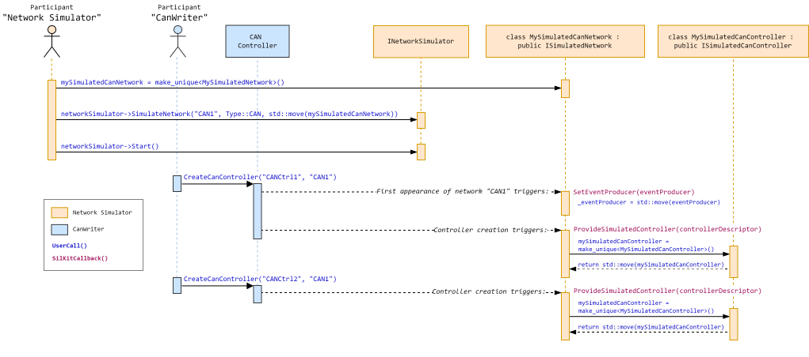
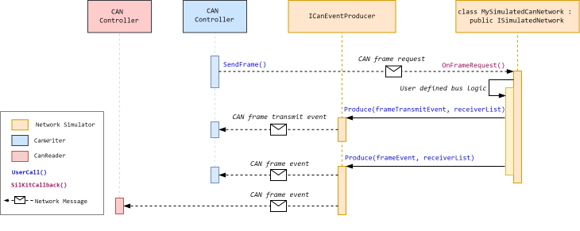

========================================
Custom Network Simulator
========================================

.. |ProductName| replace:: SIL Kit
.. |Netsim| replace:: Network Simulator

.. |INetworkSimulator| replace:: :cpp:class:`INetworkSimulator<SilKit::Experimental::NetworkSimulation::INetworkSimulator>`
.. |ISimulatedNetwork| replace:: :cpp:class:`ISimulatedNetwork<SilKit::Experimental::NetworkSimulation::ISimulatedNetwork>`
.. |ISimulatedController| replace:: :cpp:class:`ISimulatedController<SilKit::Experimental::NetworkSimulation::ISimulatedController>`
.. |ISimulatedCanController| replace:: :cpp:class:`ISimulatedCanController<SilKit::Experimental::NetworkSimulation::Can::ISimulatedCanController>`

.. |Start| replace:: :cpp:func:`Start()<SilKit::Experimental::NetworkSimulation::INetworkSimulator::Start>`
.. |SimulateNetwork| replace:: :cpp:func:`SimulateNetwork<SilKit::Experimental::NetworkSimulation::INetworkSimulator::SimulateNetwork>`

.. |ProvideSimulatedController| replace:: :cpp:func:`ProvideSimulatedController()<SilKit::Experimental::NetworkSimulation::ISimulatedNetwork::ProvideSimulatedController>`
.. |SetEventProducer| replace:: :cpp:func:`SetEventProducer()<SilKit::Experimental::NetworkSimulation::ISimulatedNetwork::SetEventProducer>`

.. |IEventProducer| replace:: :cpp:class:`IEventProducer<SilKit::Experimental::NetworkSimulation::IEventProducer>`
.. |ICanEventProducer| replace:: :cpp:class:`ICanEventProducer<SilKit::Experimental::NetworkSimulation::ICanEventProducer>`

.. |OnFrameRequest| replace:: :cpp:func:`OnFrameRequest()<SilKit::Experimental::NetworkSimulation::ISimulatedCanController::OnFrameRequest>`
.. |Produce| replace:: :cpp:func:`Produce()<SilKit::Experimental::NetworkSimulation::ISimulatedCanController::ICanEventProducer::Produce>`

.. |SendCanFrame| replace:: :cpp:func:`SendFrame()<SilKit::Services::Can::ICanController::SendFrame>`

.. |SetSimulationStepHandler| replace:: :cpp:func:`SetSimulationStepHandler()<SilKit::Services::Orchestration::ITimeSyncService::SetSimulationStepHandler()>`
.. |StartLifecycle| replace:: :cpp:func:`StartLifecycle()<SilKit::Services::Orchestration::ILifecycleService::StartLifecycle()>`

.. _sec:sil-kit-netsim:

With the |Netsim| API, a custom network simulation for CAN, LIN, Ethernet or Flexray is made accessible.
The core concept is that all controller communication is redirected to a network simulator participant who performs the detailed simulation and is responsible for the final message distribution.
The scope of the |Netsim| API is to manage the message flow for incoming and outgoing messages, not to perform the simulation logic.

.. warning::

  The |Netsim| API is experimental and might be changed or removed in future versions of the |ProductName|.

.. contents::
   :local:
   :depth: 2

Using the |Netsim| API
======================

The usage of the |Netsim| API can be split into a configuration- and a simulation phase.
In the *configuration phase*, the |Netsim| defines the simulated networks while other participants create their controllers.
The |ProductName| takes care of informing the |Netsim| about the emerging controllers.
Vice versa, the controllers are informed that their network is simulated by the |Netsim|.
The controllers on a simulated network will route their outgoing messages exclusively to the |Netsim|.
Note that this behavior switch does not require any action on the participant that holds the controller.
If the controller was configured with a network name that the |Netsim| defined as a simulated network, the new routing will take place automatically.

In the *simulation phase*, each message (e.g., controller configuration, frame requests) triggers a callback on the |Netsim|.
These callbacks will drive the simulation implemented by the user.
For outgoing messages, the |Netsim| API allows to produce events that can target individual controllers.
E.g., a frame request will finally result in a frame transmission for all controllers and an acknowledge message for the triggering controller.

Configuration phase
-------------------

The entry point of the |Netsim| API is the creation of an |INetworkSimulator| at a participant.
Only one network simulator per participant is allowed:

.. code-block:: cpp

    INetworkSimulator* networkSimulator = SilKit::Experimental::Participant::CreateNetworkSimulator(participant.get());

On the |INetworkSimulator| instance, simulated networks can be registered.
This affects controller of the given type in the whole |ProductName| simulation, if their configured network name and type matches.

.. code-block:: cpp

    auto mySimulatedCanNetwork = std::make_unique<MySimulatedCanNetwork>("CAN1");
    networkSimulator->SimulateNetwork("CAN1", SimulatedNetworkType::CAN, std::move(mySimulatedCanNetwork));

The instance ``mySimulatedCanNetwork`` passed in |SimulateNetwork| represents a specific, named simulated network.
The underlying class must inherit from the |ISimulatedNetwork| interface and must be implemented by the user of the |Netsim| API.
Its purpose is twofold:

1. Providing a producer object to send out messages to targeted controllers.
   This happens once per network by a a call from the |ProductName| to |SetEventProducer|, here on the *mySimulatedCanNetwork* instance.
   In |SetEventProducer|, an ``IEventProducer`` instance is handed over to the user. 
   After casting to the specific event producer for the corresponding network type (e.g. to ``ICanEventProducer``), the event producer can send targeted messages to the desired recipients.

.. code-block:: cpp

    void MySimulatedCanNetwork::SetEventProducer(std::unique_ptr<IEventProducer> eventProducer) {
        
        // Store the incoming event producer
        _eventProducer = std::move(eventProducer);
    }

    auto MySimulatedCanNetwork::GetCanEventProducer()
    {
        // Cast and return the CAN event producer
        return static_cast<Can::ICanEventProducer*>(_eventProducer.get());
    }

2. Getting informed about emerging remote controllers and providing a target for the redirected communication (i.e. the *simulated controller*). 
   This happens by calls from the |ProductName| to |ProvideSimulatedController|, here on the *mySimulatedCanNetwork* instance, whenever a participant creates a controller.
   The method provides routing information to address the controller (i.e., the *controller descriptor*) and expects the user to return an instance that implements the |ISimulatedController| interface.
   For the different network types, one of the specific child classes (e.g., |ISimulatedCanController| for CAN networks) must be used.
   After providing the simulated controller, all messages from the original controller will be routed only to the |Netsim| and trigger message specific reception functions on the provided simulated controller instance.
   Other controllers will no longer receive the messages.

.. code-block:: cpp

    auto MySimulatedCanNetwork::ProvideSimulatedController(ControllerDescriptor controllerDescriptor) -> ISimulatedController*
    {
        // Bookkeeping of the controller descriptors
        _controllerDescriptors.push_back(controllerDescriptor);

        // Store the simulated controllers
        _mySimulatedCanControllers.emplace_back(std::make_unique<MySimulatedCanController>(this, controllerDescriptor));
        
        // Return the interface pointer
        return _mySimulatedControllers.back().get();
    }

The following graph shows the |Netsim| API usage of the configuration phase:

.. _label:netsim-api-discovery:

   : Exemplary configuration phase of a network simulation.

Simulation phase
----------------

Via the provided implementation of an |ISimulatedController| in |ProvideSimulatedController|, the user receives events generated by the original controller. 
An ``On...()`` callback exists for each possible message of a controller. 
E.g., if a remote controller on a simulated network intends to sends a CAN frame and calls |SendCanFrame|, |OnFrameRequest| is triggered on the |ISimulatedCanController|.
The ``On...()`` callbacks represent the message input of the |Netsim|. 
For outgoing CAN messages, the |Produce| methods from the |ICanEventProducer| can be used.

In the following code snippet, the simple simulation logic is to send out a *CAN frame transmit event* to the requesting controller and the actual *CAN frame event* as a broadcast to all controllers. 
Here, the |IEventProducer| was obtained in |SetEventProducer| and is stored in ``MySimulatedCanNetwork``.
To target only the desired recipients, the receivers must be specified as a :ref:`span<sec:memory-man-span>` of controller descriptors in all ``Produce()`` methods.

.. code-block:: cpp

    void MySimulatedCanController::OnFrameRequest(const CanFrameRequest& frameRequest)
    {
        // Create the transmit acknowledge for the sending CAN controller
        Services::Can::CanFrameTransmitEvent ack;
        ack.canId = frameRequest.frame.canId;
        ack.status = Services::Can::CanTransmitStatus::Transmitted;
        ack.timestamp = _scheduler->Now(); // The custom scheduler has knowledge about the virtual simulation time
        ack.userContext = frameRequest.userContext;

        // Define the single receiver (the remote controller)
        std::array<ControllerDescriptor, 1> singleReceiverArray{_controllerDescriptor};
        auto singleReceiver = SilKit::Util::MakeSpan(singleReceiverArray);

        // Produce the transmit acknowledge event 
        _mySimulatedCanNetwork->GetCanEventProducer()->Produce(std::move(ack), singleReceiver);

        // Distribute the frame to all controllers
        Services::Can::CanFrameEvent frameEvent;
        frameEvent.direction = Services::TransmitDirection::RX;
        frameEvent.frame = frameRequest.frame;
        frameEvent.timestamp = _scheduler->Now();
        frameEvent.userContext = frameRequest.userContext;
        std::vector<uint8_t> payloadBytes{frameRequest.frame.dataField.begin(), frameRequest.frame.dataField.end()};
        frameEvent.frame.dataField = SilKit::Util::ToSpan(payloadBytes);

        // Produce the actual frame event
        _mySimulatedNetwork->GetCanEventProducer()->Produce(frameEvent, _mySimulatedNetwork->GetAllReceivers());
    }

The following graph shows the corresponding event flow and |Netsim| API for the code snippet:

.. _label:netsim-api-runtime:

   : Exemplary simulation phase of a network simulation.

See the :ref:`Network Simulator Demo<sec:util-netsim-demo>` for a complete example with class definitions and a custom scheduler.

Handling simulation time
------------------------

A central use case of a |Netsim| is to simulate detailed time behavior of a virtual bus network.
Emulating network specific behavior is not part of the |Netsim| API and has to be implemented by the user.
For a simulation with :ref:`virtual time synchronization<sec:sim-synchronization>`, this can be achieved by a custom scheduler.
The scheduler is provided with time-related events in the |Netsim| and updates the simulation time in the |SetSimulationStepHandler|.
When the virtual time advances, the custom scheduler triggers the due events. 
Further, the scheduler can provide the current simulation time for the produced events as shown in the code snippets.

Integrating in the |ProductName| Lifecycle
------------------------------------------

Usually, a |Netsim| is integrated in setup with distributed participants that use a :ref:`coordinated lifecycle<subsubsec:sim-lifecycle-starting-a-simulation>`.
This means that it is mandatory to know beforehand which participants will take part in the simulation and that all participants agree on a starting point of the simulation.
Although it is not enforced by the |Netsim| API, this is the recommended lifecycle operation mode for |ProductName| simulations with a |Netsim|.
The central reason is that in using a coordinated lifecycle, the |Netsim| cannot miss any message sent by the controllers, especially initial configuration messages that are essential to perform the bus simulation.
The following aspects have to be considered that the |Netsim| is guaranteed to receive all messages in the distributed setup without any restrictions to the starting order of the participants:

- The |Netsim| and all participants that hold simulated controllers must use a *coordinated lifecycle*.
- As a consequence, a :ref:`System Controller<sec:util-system-controller>` must be used that knows all required participant names.
- The |Netsim| must call |Start| before starting his lifecycle via |StartLifecycle|.
- The participants must not trigger any bus message before their lifecycle state reaches :cpp:enumerator:`CommunicationReady<SilKit::Services::Orchestration::ParticipantState::CommunicationReady>`.
  Read the documentation on :ref:`Lifecycle Management<sec:sim-lifecycle-management>` for further details.

API and Data Type Reference
===========================

NetworkSimulator API
--------------------

.. doxygenclass:: SilKit::Experimental::NetworkSimulation::INetworkSimulator
   :members:

.. doxygenclass:: SilKit::Experimental::NetworkSimulation::ISimulatedNetwork
   :members:

.. doxygenclass:: SilKit::Experimental::NetworkSimulation::ISimulatedController
   :members:

.. doxygenclass:: SilKit::Experimental::NetworkSimulation::Can::ISimulatedCanController
   :members:

.. doxygenclass:: SilKit::Experimental::NetworkSimulation::Ethernet::ISimulatedEthernetController
   :members:

.. doxygenclass:: SilKit::Experimental::NetworkSimulation::Lin::ISimulatedLinController
   :members:

.. doxygenclass:: SilKit::Experimental::NetworkSimulation::Flexray::ISimulatedFlexRayController
   :members:

.. 
    Data Structures
    ---------------

    .. doxygenstruct:: SilKit::Experimental::NetworkSimulation::ControllerDescriptor
        :members:

Enumerations and Typedefs
-------------------------

.. doxygenenum:: SilKit::Experimental::NetworkSimulation::SimulatedNetworkType
