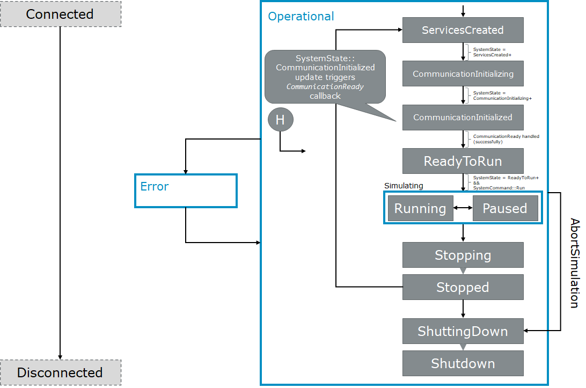

Simulation
**********
.. 
  macros for internal use
..
  General macros
.. |ProductName| replace:: SIL Kit
..
  API references
.. |LifecycleServiceAPI| replace:: :cpp:class:`ILifecycleService<SilKit::Services::Orchestration::ILifecycleService>`
.. |TimeSyncServiceAPI| replace:: :cpp:class:`ITimeSyncService<SilKit::Services::Orchestration::ITimeSyncService>`
.. |SystemControllerAPI| replace:: :cpp:class:`ISystemController<SilKit::Services::Orchestration::ISystemController>`
.. |SystemMonitorAPI| replace:: :cpp:class:`ISystemMonitor<SilKit::Services::Orchestration::ISystemMonitor>`
.. |CompleteSimulationTask| replace:: :cpp:func:`CompleteSimulationTask()<SilKit::Services::Orchestration::ITimeSyncService::CompleteSimulationTask()>`
.. |StartLifecycle| replace:: :cpp:func:`StartLifecycle()<SilKit::Services::Orchestration::ILifecycleService::StartLifecycle()>`

.. 
  Section references 
.. |LifecycleService| replace:: :ref:`Life Cycle Service<subsubsec:sim-lifecycle-lifecycleService>`
.. |TimeSyncService| replace:: :ref:`Time Synchronization Service<subsubsec:sim-lifecycle-timeSyncService>`
.. |SystemController| replace:: :ref:`System Controller<subsubsec:sim-lifecycle-systemController>`
.. |SystemMonitor| replace:: :ref:`System Monitor<subsubsec:sim-lifecycle-systemMonitor>`

..
  Reference implementations, etc.
.. |SilKitSystemController| replace:: :ref:`SIL Kit System Controller Utility<sec:util-system-controller>`

The following chapter explains, how a simulation using the |ProductName| works.
It first introduces the properties that affect the participants' behavior towards other participants.
Then, the life cycle of individual simulation participants and the overall simulation are detailed.
Afterwards, details about a simulation run with synchronized participants are presented.
The chapter closes with details about the middleware that the reference implementation of the |ProductName| uses.

.. _sec:sim-types:

Properties of Participants
==========================

Generally, a |ProductName| participant can communicate with other participants without knowledge about their existence.
However, participants can register a :cpp:func:`SetParticipantConnectedHandler()<SilKit::Services::Orchestration::ISystemMonitor::SetParticipantConnectedHandler()>`  callback that notifies them once a new participant connects.
Analogously, they can register a :cpp:func:`SetParticipantDisconnectedHandler()<SilKit::Services::Orchestration::ISystemMonitor::SetParticipantDisconnectedHandler()>` callback that notifies them when a participant disconnects.

However, participants can also use a life cycle service that allows them to coordinate their startup and shutdown phase with other participants (see :ref:`Life Cycle Coordination Between Participants<sec:sim-lifecycle-management>`).
In addition, participants with a life cycle can use the virtual time synchronization (see :ref:`Synchronized Simulation Run<sec:sim-synchronization>`).

.. _sec:sim-lifecycle-management:

Life Cycle Management
=====================

The |ProductName| provides life cycle management for individual participants and the overall simulation.
The following first introduces means to observe and control the life cycle.
Afterwards, the life cycle of synchronized participants and the life cycle of the overall simulation are introduced.

Life Cycle Control
------------------

There are two levels of granularity when it comes to life cycle management: a local life cycle that affects the state of an individual participant and a simulation-wide system life cycle.
The following introduces the three components that can affect and observe the individual and global life cycle.

.. _subsubsec:sim-lifecycle-lifecycleService:

**Life cycle service:**
The |LifecycleServiceAPI| interface allows each participant to access various functions related to its life cycle.
Users can register callbacks that trigger once a participant reaches certain states.
Available callbacks are :cpp:func:`SetCommunicationReadyHandler()<SilKit::Services::Orchestration::ILifecycleService::SetCommunicationReadyHandler()>`, :cpp:func:`SetStopHandler()<SilKit::Services::Orchestration::ILifecycleService::SetStopHandler()>`, and :cpp:func:`SetShutdownHandler()<SilKit::Services::Orchestration::ILifecycleService::SetShutdownHandler()>`.
Further, the life cycle service provides access to the |TimeSyncServiceAPI| interface (see below).
Once all needed controllers are registered and, if needed, the time synchronization service was retrieved and configured, the participants' life cycle can be published by calling |StartLifecycle| (see :ref:`Life Cycle Coordination Between Participants<sec:sim-lifecycle-syncParticipants>`).

.. _subsubsec:sim-lifecycle-timeSyncService:

**Time synchronization service:**

The |TimeSyncServiceAPI| interface allows users to set a simulation task, which is important for participants with virtual time synchronization.
A simulation task is a function that is triggered at the beginning of each simulation step of a participant.
In addition, the step length of each simulation step can be set via :cpp:func:`ITimeSyncService::SetPeriod()<SilKit::Services::Orchestration::ITimeSyncService::SetPeriod()>`.

.. _subsubsec:sim-lifecycle-systemMonitor:

**System monitor:**
To observe the state transitions of other participants, users first need to retrieve the |SystemMonitorAPI| interface via :cpp:func:`GetSystemMonitor()<SilKit::IParticipant::GetSystemMonitor()>`.
Afterwards, they can register a participant status callback via :cpp:func:`AddParticipantStatusHandler()<SilKit::Services::Orchestration::ISystemMonitor::AddParticipantStatusHandler()>`
In addition, users can register a callback for changes of the overall system state via :cpp:func:`AddSystemStateHandler()<SilKit::Services::Orchestration::ISystemMonitor::AddSystemStateHandler()>`.
The system state corresponds to the earliest state of all required participants.
For example, two Participants A and B are required. A is in state :cpp:enumerator:`ReadyToRun<SilKit::Services::Orchestration::ParticipantState::ReadyToRun>` and B is in :cpp:enumerator:`Running<SilKit::Services::Orchestration::ParticipantState::Running>`, then the system state would be :cpp:enumerator:`ReadyToRun<SilKit::Services::Orchestration::SystemState::ReadyToRun>` (as Running follows ReadyToRun).

.. _subsubsec:sim-lifecycle-systemController:

**System controller:**
The |SystemControllerAPI| interface allows users to signal state transitions to all or individual participants.
The remainder of this documentation refers to these signals as *system commands*.
Although any participant has a system controller and could therefore steer the simulation, we recommend to either dedicate one participant to take care of the simulation's life cycle management or to define a participant that will do this.
Please note that the system controller interface does not provide any means to automatically handle states of individual participants or the entire simulation.
We provide a reference implementation that provides all necessary state transitions for a properly working simulation (see |SilKitSystemController| for details). 

.. _sec:sim-lifecycle-syncParticipants:

Life Cycle Coordination Between Participants
--------------------------------------------

Each participant has an independent life cycle that other participants can observe through the |SystemMonitor|.
The participant's life cycle (see :numref:`label:sim-lifecycle`) can be divided into four stages: preparation, running, stop, and shut down.
For all phases, the |LifecycleService| or |TimeSyncService| allow setting callbacks that are executed in that phase.

..
.. _label:sim-lifecycle:

   : |ProductName| participant state machine.

A participant enters the distributed state machine by calling |StartLifecycle|.
This will cause the |LifecycleService| to anounce its state as :cpp:enumerator:`ServicesCreated<SilKit::Services::Orchestration::ParticipantState::ServicesCreated>`, indicating that all services were created and announced to other participants.

A participant that uses the life cycle service may choose to coordinate its state with other participants from the start of the life cycle until the simulation is running.
In that case, they will align their participant state based on the current system state until they reach :cpp:enumerator:`CommunicationInitialized<SilKit::Services::Orchestration::ParticipantState::CommunicationInitialized>`.
Once the system state also changes to CommunicationInitialized, the communication between all participants via :cpp:class:`DataPublisher<SilKit::Services::PubSub::IDataPublisher>` and :cpp:class:`DataSubscriber<SilKit::Services::PubSub::IDataSubscriber>` is possible.
This information is propagated to the user if they registered the callback via :cpp:func:`SetCommunicationReadyHandler()<SilKit::Services::Orchestration::ILifecycleService::SetCommunicationReadyHandler()>`.
Once the callback is finished, the participant state changes to :cpp:enumerator:`ReadyToRun<SilKit::Services::Orchestration::ParticipantState::ReadyToRun>`.
The participant will wait for the system state to change to :cpp:enumerator:`ReadyToRun<SilKit::Services::Orchestration::SystemState::ReadyToRun>` and until it receives a :cpp:func:`Run()<SilKit::Services::Orchestration::ISystemController::Run()>` to progress.

Participants that coordinate their state but do not use the virtual time synchronization can register a :cpp:func:`SetStartingHandler()<SilKit::Services::Orchestration::ILifecycleService::SetStartingHandler()>`, which indicates that the synchronized participants will start the virtual time synchronization and thus the simulation.
This callback does not block the other participants and should only be used to start timers etc.
If a participant uses the synchronized virtual time, the provided simulation task is executed repeatedly during the 'Running' state (see :ref:`Simulation Synchronization<sec:sim-synchronization>` for details).

Participants may also choose not to coordinate their state with other participants.
In this case, their state will transition to the Running phase without waiting for other any system states or system commands.
They still receive the CommunicationReady callback before changing to :cpp:enumerator:`ReadyToRun<SilKit::Services::Orchestration::ParticipantState::ReadyToRun>`, but the communication guarantee does not apply.

Participants that use the virtual time synchronization repeatedly execute their registered SimTask while advancement of time is handled by the middleware implementation.
If a participant temporarily cannot advance the simulation, e.g., because a debugger is attached to investigate its internal state, a participant can be put into the :cpp:enumerator:`Paused<SilKit::Services::Orchestration::ParticipantState::Paused>` state.

It is also possible to coordinate the state with other participants after the running phase of the simulation.
Those participants stop their simulation run once they receive the system command :cpp:func:`Stop()<SilKit::Services::Orchestration::ISystemController::Stop()>`.
A callback registered via :cpp:func:`SetStopHandler()<SilKit::Services::Orchestration::ILifecycleService::SetStopHandler()>` can be used to perform a collection of simulation results.
Once all participants have successfully executed their StopHandler and the system is in state :cpp:enumerator:`Stopped<SilKit::Services::Orchestration::SystemState::Stopped>`, a |SystemController| can either end the simulation via :cpp:func:`Shutdown()<SilKit::Services::Orchestration::ISystemController::Shutdown()>` or restart it via :cpp:func:`Restart()<SilKit::Services::Orchestration::ISystemController::Restart()>`.
In the latter case, simulation time is reset to zero and the participant returns to the :cpp:enumerator:`ServicesCreated<SilKit::Services::Orchestration::ParticipantState::ServicesCreated>` state.

Participants that do not coordinate their state after the simulation need to be stopped manually via :cpp:func:`Stop()<SilKit::Services::Orchestration::ILifecycleService::Stop()>`.
They also enter Stopping, call the :cpp:func:`SetStopHandler()<SilKit::Services::Orchestration::ILifecycleService::SetStopHandler()>` and go to Stopped afterwards.
Instead of waiting for further instructions, they directly transition to the ShuttingDown state, call the :cpp:func:`SetShutdownHandler()<SilKit::Services::Orchestration::ILifecycleService::SetShutdownHandler()>` and transition to the Shutdown state.

Whenever a participant encounters an error from which it cannot recover, it switches to the :cpp:enumerator:`Error<SilKit::Services::Orchestration::ParticipantState::Error>` state to indicate this situation to the system. 
Users can manually trigger a transition to the error state and provide more information about the cause by calling :cpp:func:`ReportError()<SilKit::Services::Orchestration::ILifecycleService::ReportError()>`.
In some situations, a life cycle service automatically enters the error state, e.g., when an uncaught exception is thrown in a callback.
A participant can only recover from the :cpp:enumerator:`Error<SilKit::Services::Orchestration::ParticipantState::Error>` state in two ways: Shutdown or Restart (althrough the latter is only possible for coordinated participants).

.. _subsec:sim-lifecycle:

Simulation-wide Life Cycle (System State)
-----------------------------------------

The life cycle of the overall simulation is derived from the states of a defined set of participants.
Changes to the system state can be observed via the SystemMonitor.

The set of participants that define the system state must be defined via :cpp:func:`ISystemController::SetWorkflowConfiguration()<SilKit::Services::Orchestration::ISystemController::SetWorkflowConfiguration()>` before the simulation is started (see :ref:`above<subsubsec:sim-lifecycle-systemController>` for details).
The system state is defined as follows:
1. If any required participant is not available, the system state is Invalid.
2. If all required participants are in the same state, the system state will also be in this state. For example, if all required participants are in the state :cpp:enumerator:`Running<SilKit::Services::Orchestration::ParticipantState::Running>`, the system state is :cpp:enumerator:`Running<SilKit::Services::Orchestration::SystemState::Running>` too.
3. If not all required participants are in the same state, the 'earliest' state is used. For example, if a required participant 'A' is in :cpp:enumerator:`CommunicationInitialized<SilKit::Services::Orchestration::ParticipantState::CommunicationInitialized>` and a required participant 'B' is in :cpp:enumerator:`ReadyToRun<SilKit::Services::Orchestration::ParticipantState::ReadyToRun>`, then the system state is :cpp:enumerator:`CommunicationInitialized<SilKit::Services::Orchestration::SystemState::CommunicationInitialized>`.

The main exception to this rule are the :cpp:enumerator:`Paused<SilKit::Services::Orchestration::ParticipantState::Paused>`, :cpp:enumerator:`Error<SilKit::Services::Orchestration::ParticipantState::Error>`, and :cpp:enumerator:`Stopping<SilKit::Services::Orchestration::ParticipantState::Stopping>` states, which can be regarded as dominant states.
For example, if just one participant enters the Error state, the system state will be regarded as Error as well.

The system state follows state transitions in a lazy manner.
This means that the system state remains the old state until all relevant participants have reached the new state.
For example, the system state remains :cpp:enumerator:`ServicesCreated<SilKit::Services::Orchestration::SystemState::ServicesCreated>` until all relevant participants have achieved the :cpp:enumerator:`CommunicationInitializing<SilKit::Services::Orchestration::ParticipantState::CommunicationInitializing>` state.

In all cases that do not match any of the above, the system state will be regarded as :cpp:enumerator:`Invalid<SilKit::Services::Orchestration::SystemState::Invalid>`.
This should typically not occur.

.. _sec:sim-synchronization:

Synchronized Simulation Run
===========================

The following first gives a general overview of a simulation run using the |ProductName|. 
Afterwards, possibilities to configure the period length of a simulation step and to define the simulation task that is being executed during a simulation step are introduced.
The last part details what time information |ProductName| clients provide, depending on their synchronization mode.

Simulation Overview
-------------------
An |ProductName| simulation is designed as a discrete-event simulation. 
This means, that each event of a participant occurs at a distinct point in time.
Synchronized participants exchange information about the next point in time at which they intend to execute their *simulation task*.
Based on this information they can infer if they can trigger their next simulation task or if they still need to wait for other participans to finish their tasks.
Each participant executes its simulation task periodically. 
The simulation time between the execution is configurable (:ref:`see below<subsec:sim-simulationPeriod>`).
At the beginning of these so called *simulation steps*, a previously set task will be executed.

.. _subsec:sim-simulationPeriod:

Configuration of the Period Length
----------------------------------
Each synchronized participant needs to define a period length via :cpp:func:`ITimeSyncService::SetPeriod()<SilKit::Services::Orchestration::ITimeSyncService::SetPeriod()>`.
This sets a constant step size at which the participant will step through the simulation.
The period length can be changed at any time.
The period length defaults to 1ms if :cpp:func:`ITimeSyncService::SetPeriod()<SilKit::Services::Orchestration::ITimeSyncService::SetPeriod()>` is never called.
Note that each participant may have a different period length. 

Configuration of the Simulation Task
------------------------------------
Each synchronized participant **must** define a simulation task that will be executed at the start of each simulation step (see :ref:`above<subsec:sim-simulationPeriod>`).
Users can provide the simulation task either as a synchronous or an asynchronous task.
The synchronous task is set by calling :cpp:func:`SetSimulationStepHandler()<SilKit::Services::Orchestration::ITimeSyncService::SetSimulationStepHandler()>`
and providing the task to be executed as a delegate function.
Note that the simulation task is not necessarily executed on the main thread of the application.
After the execution of the simulation task is finished, the other participants are informed about the next point in time at which the participant intends to execute its task.
Users can exchange the task by calling SetSimulationStepHandler again, but they cannot intervene during its execution.

Sometimes, it may be desirable to have more control about the simulation task execution.
In these cases, the asynchronous simulation task execution may be preferable.

Similar to the synchronous case, an asynchronous simulation task is set by calling :cpp:func:`SetSimulationStepHandlerAsync()<SilKit::Services::Orchestration::ITimeSyncService::SetSimulationStepHandlerAsync()>`.
It is executed at the start of each simulation step, but it does not automatically signal other participants that the current simulation task is finished.
Instead, the user is required to call |CompleteSimulationTask| to signal the completion of the current simulation step.
This enables the user to have fine-grained control over the synchronous simulation progress.
Also, this allows two participants to communicate without increasing the simulation time.

.. admonition:: Note

    Asynchronous simulation tasks are non-blocking. 
    This means that it is possible that callbacks from received messages are triggered concurrently during the execution of the simulation task.
    Users need to make sure that their data is protected against concurrent read/write access.

.. admonition:: Note

    Calling |CompleteSimulationTask| will advance the simulation time regardless of the execution state of the asynchronous simulation task.

.. _subsec:sim-sync-timestamps:

Timestamps in Messages
----------------------
.. admonition:: Note
  
   The following describes the current behavior and will change in the foreseeable future.

Each sent bus event is annotated with a timestamp, at which it was sent. 
The timestamp is set automatically by the |ProductName| client.
Users do not have to (and should not try to) manually set the timestamp of a message.
Depending on the mode of the participant (synchronized/unsynchronized) and whether the network is managed by a a network simulator, the timestamp's meaning and precision may differ.
If a network simulator is available for a given network, it takes precedence of the timestamp control and overrides the timestamps of any bus message.

The following table provides an overview of the behavior, if no network simulator is available.

.. list-table:: : Message timestamp by synchronization mode
   :widths: 20 40 40
   :header-rows: 1

   * - Sender / Receiver
     - Unsynchronized
     - Synchronized
   * - Unsynchronized
     - Undefined
     - Use timestamp of own simulation step
   * - Synchronized
     - Undefined
     - Use timestamp of sender

.. _subsec:sim-syncExample:

SIL Kit Middleware
-------------------------------------------

The provided implementation of the |ProductName| headers uses an internal middleware that is provided with the |ProductName|.
Within it, all participants exchange their messages via direct messaging based on TCP connections or Unix domain sockets.

The internal middleware guarantees message delivery to always be in-order.
This enables the usage of a distributed synchronization algorithm.
:numref:`label:sim-messageDelivery` shows the synchronization algorithm:

.. _label:sim-messageDelivery:
.. figure:: ../_static/sim-inorder-strict.png
   :alt: Vector SIL Kit message delivery
   :align: center
   :width: 90%

   : |ProductName| delivery of messages.

The algorithm reports the start time of the next due simulation step to all other participants (``next@`` messages in the figure).
By taking the other participants' next simulation step into account, a participant knows when it can safely execute its next simulation step.
That is, when there are no more simulation steps of other participants with an earlier timestamp than its own next simulation step.
