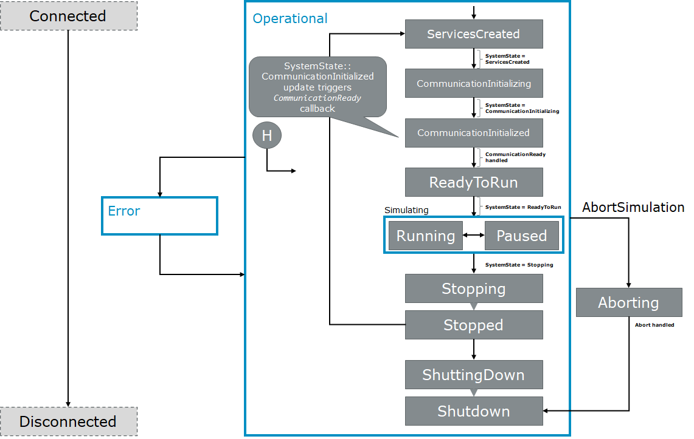

==========
Simulation
==========
..
  macros for internal use
..
  General macros
.. |ProductName| replace:: SIL Kit
..
  API references
.. |ILifecycleService| replace:: :cpp:class:`ILifecycleService<SilKit::Services::Orchestration::ILifecycleService>`
.. |ITimeSyncService| replace:: :cpp:class:`ITimeSyncService<SilKit::Services::Orchestration::ITimeSyncService>`
.. |ISystemController| replace:: :cpp:class:`ISystemController<SilKit::Experimental::Services::Orchestration::ISystemController>`
.. |ISystemMonitor| replace:: :cpp:class:`ISystemMonitor<SilKit::Services::Orchestration::ISystemMonitor>`

.. |Stop| replace:: :cpp:func:`Stop()<SilKit::Services::Orchestration::ILifecycleService::Stop()>`
.. |StartLifecycle| replace:: :cpp:func:`StartLifecycle()<SilKit::Services::Orchestration::ILifecycleService::StartLifecycle()>`

.. |OperationMode_Coordinated| replace:: :cpp:enumerator:`OperationMode::Coordinated<SilKit::Services::Orchestration::OperationMode::Coordinated>`
.. |OperationMode_Autonomous| replace:: :cpp:enumerator:`OperationMode::Autonomous<SilKit::Services::Orchestration::OperationMode::Autonomous>`

.. |RunningState| replace:: :cpp:enumerator:`Running<SilKit::Services::Orchestration::ParticipantState::Running>`
.. |PausedState| replace:: :cpp:enumerator:`Paused<SilKit::Services::Orchestration::ParticipantState::Paused>`
.. |StoppingState| replace:: :cpp:enumerator:`Stopping<SilKit::Services::Orchestration::ParticipantState::Stopping>`
.. |StoppedState| replace:: :cpp:enumerator:`Stopped<SilKit::Services::Orchestration::ParticipantState::Stopped>`
.. |ErrorState| replace:: :cpp:enumerator:`Error<SilKit::Services::Orchestration::ParticipantState::Error>`

.. |SetParticipantConnectedHandler| replace:: :cpp:func:`SetParticipantConnectedHandler()<SilKit::Services::Orchestration::ISystemMonitor::SetParticipantConnectedHandler()>`
.. |SetParticipantDisconnectedHandler| replace:: :cpp:func:`SetParticipantDisconnectedHandler()<SilKit::Services::Orchestration::ISystemMonitor::SetParticipantDisconnectedHandler()>`

.. |DataPublisher| replace:: :cpp:class:`DataPublisher<SilKit::Services::PubSub::IDataPublisher>`
.. |DataSubscriber| replace:: :cpp:class:`DataSubscriber<SilKit::Services::PubSub::IDataSubscriber>`
.. |RpcClient| replace:: :cpp:class:`RpcClient<SilKit::Services::Rpc::IRpcClient>`
.. |RpcServer| replace:: :cpp:class:`RpcServer<SilKit::Services::Rpc::IRpcServer>`

..
  Section references 
.. |LifecycleService| replace:: :ref:`Lifecycle Service<subsubsec:sim-lifecycle-lifecycleService>`
.. |TimeSyncService| replace:: :ref:`Time Synchronization Service<subsubsec:sim-lifecycle-timeSyncService>`
.. |SystemController| replace:: :ref:`System Controller<subsubsec:sim-lifecycle-systemController>`
.. |SystemMonitor| replace:: :ref:`System Monitor<subsubsec:sim-lifecycle-systemMonitor>`

..
  Reference implementations, etc.
.. |SilKitSystemController| replace:: :ref:`SIL Kit System Controller Utility<sec:util-system-controller>`

.. contents::
   :local:
   :depth: 2

The following chapter explains how a simulation using the |ProductName| works.
It first introduces the properties that affect the participants' behavior towards other participants.
Then, the lifecycle of individual simulation participants and the overall simulation are detailed.
Afterwards, details about the virtual time synchronization are presented.

.. _sec:sim-types:

Participants in the Distributed System
======================================

This chapter gives a quick overview about how a |ProductName| participant is related to other participant in the distributed system.

Communication
-------------

Generally, a |ProductName| participant can communicate with other participants without knowledge of their existence.
The message transport in a |ProductName| simulation relies on string-based **network names** for bus systems and **topics** for PubSub/RPC.
These are specified by the individual communication services of a participant.
If they match for any services across all participants in the system, the services will be able to exchange messages.

Connection notification
-----------------------

Participants can register a handler with |SetParticipantConnectedHandler| that is called when a new participant connects.
Analogously, |SetParticipantDisconnectedHandler| is used to get notified when a participant disconnects.

Orchestration Services
----------------------

* Participants can optionally use a :ref:`lifecycle service<subsubsec:sim-lifecycle-lifecycleService>` to have a more detailed control about the simulation flow and the state of other participants.
  Also, the lifecycle service allows participants to coordinate their startup and shutdown phase among each other.

* In addition, participants with a lifecycle can optionally use the time synchronization service to enable :ref:`virtual time synchronization<sec:sim-synchronization>`.

* To observe lifecycle state transitions by the participants, the :ref:`system monitor service<subsubsec:sim-lifecycle-systemMonitor>` can be used.

* To have a central instance that define which participants are required for the simulation and to trigger system-wide commands like aborting the simulation, |ProductName| provides the :ref:`system controller service<subsubsec:sim-lifecycle-systemController>`.

.. _sec:sim-lifecycle-management:

Lifecycle Management
=====================

The |ProductName| provides lifecycle management for individual participants and the overall simulation.
The following first introduces means to observe and control the lifecycle.
Afterwards, the participants' states, the transition logic between the states, and the lifecycle of the overall simulation are introduced.

There are two levels of granularity when it comes to lifecycle management: a local lifecycle that affects the state of an individual participant and a simulation-wide system lifecycle.
The following introduces the three components that can affect and observe the individual and global lifecycle.

.. _subsubsec:sim-lifecycle-lifecycleService:

Lifecycle Service
-----------------
The |ILifecycleService| interface allows each participant to access various functions related to its lifecycle.
Users can register callbacks that trigger once a participant reaches certain states.
Available callbacks are :cpp:func:`SetCommunicationReadyHandler()<SilKit::Services::Orchestration::ILifecycleService::SetCommunicationReadyHandler()>`, :cpp:func:`SetStopHandler()<SilKit::Services::Orchestration::ILifecycleService::SetStopHandler()>`, and :cpp:func:`SetShutdownHandler()<SilKit::Services::Orchestration::ILifecycleService::SetShutdownHandler()>`.
Further, the lifecycle service provides access to the |ITimeSyncService| interface, which grants access to the virtual time synchronization (see below).
If this service is not used, an additional :cpp:func:`SetStartingHandler()<SilKit::Services::Orchestration::ILifecycleService::SetStartingHandler()>` can be registered that notifies users once a simulation starts.
Once all needed controllers are registered and, if needed, the time synchronization service was retrieved and configured, the participants' lifecycle can be published by calling |StartLifecycle| (see :ref:`Lifecycle Coordination Between Participants<sec:sim-lifecycle-syncParticipants>`).

.. _subsubsec:sim-lifecycle-timeSyncService:

Time Synchronization Service
----------------------------
When the |ITimeSyncService| is created, the participant depends on the virtual time and takes part in the distributed virtual time synchronization with other participants.
The service allows users to set a *simulation step handler*, define its individual simulation step size and retrieve the current time.
When the virtual time advances in the distributed simulation, the *simulation step handler* is called and the participant must perform its task for the current time step.
It is assured that the virtual time will only increase throughout the simulation, simulation steps will never jump back or be triggered twice on a certain time.
Subsequent calls to a *simulation step handler* happen in the interval defined by the participants' simulation step size.
A time dependent participant might also rely on timestamps of incoming messages, thus the |ProductName| takes care that a time dependent participant always receives a meaningful timestamp in bus or application data messages.

.. _subsubsec:sim-lifecycle-systemMonitor:

System Monitor
--------------
To observe the state transitions of other participants, users first need to retrieve the |ISystemMonitor| interface via :cpp:func:`CreateSystemMonitor()<SilKit::IParticipant::CreateSystemMonitor()>`.
Afterwards, they can register a participant status callback via :cpp:func:`AddParticipantStatusHandler()<SilKit::Services::Orchestration::ISystemMonitor::AddParticipantStatusHandler()>`.
In addition, users can register a callback for changes of the overall system state via :cpp:func:`AddSystemStateHandler()<SilKit::Services::Orchestration::ISystemMonitor::AddSystemStateHandler()>`.
The system state corresponds to the earliest state of all required participants.
For example, two Participants A and B are required. A is in state :cpp:enumerator:`ReadyToRun<SilKit::Services::Orchestration::ParticipantState::ReadyToRun>` and B is in :cpp:enumerator:`Running<SilKit::Services::Orchestration::ParticipantState::Running>`, then the system state would be :cpp:enumerator:`ReadyToRun<SilKit::Services::Orchestration::SystemState::ReadyToRun>` (as Running follows ReadyToRun).

.. _subsubsec:sim-lifecycle-systemController:

System Controller
-----------------
.. warning::
  The System Controller is experimental and might be changed or removed in future versions of the SIL Kit.

The |ISystemController| interface allows users to set system-wide simulation parameters, such as which participants 
are required for a simulation, as well as signal commands that are processed by all participants with a 
lifecycle (see :doc:`System Controller<../api/systemcontroller>` for details).

.. admonition:: Note

    A coordinated participant must be required, or otherwise the simulation will enter an error state.

.. _sec:sim-lifecycle-syncParticipants:

The Lifecycle State Machine
---------------------------

Each participant has an independent lifecycle that other participants can observe through the |SystemMonitor|.

.. _label:sim-lifecycle:

   : |ProductName| participant state machine.

.. _subsubsec:sim-lifecycle-starting-a-simulation:

Starting a Simulation
~~~~~~~~~~~~~~~~~~~~~

A participant enters the distributed state machine by calling |StartLifecycle|.
This will cause the |LifecycleService| to announce its state as :cpp:enumerator:`ServicesCreated<SilKit::Services::Orchestration::ParticipantState::ServicesCreated>`, indicating that all services were created and announced to other participants.

A participant that uses the lifecycle service may choose to coordinate its state with other participants by creating the |ILifecycleService| with |OperationMode_Coordinated|.
In that case, they will align their participant state based on the current system state until they reach :cpp:enumerator:`CommunicationInitialized<SilKit::Services::Orchestration::ParticipantState::CommunicationInitialized>`.

Once the system state also changes to CommunicationInitialized, the communication between all participants via PubSub / RPC is possible.
This information is propagated to the user if they registered the callback via :cpp:func:`SetCommunicationReadyHandler()<SilKit::Services::Orchestration::ILifecycleService::SetCommunicationReadyHandler()>`.
Once the callback is finished, the participant state changes to :cpp:enumerator:`ReadyToRun<SilKit::Services::Orchestration::ParticipantState::ReadyToRun>`.
The participant will wait for the system state to change to :cpp:enumerator:`ReadyToRun<SilKit::Services::Orchestration::SystemState::ReadyToRun>` as well and then proceeds to the :cpp:enumerator:`Running<SilKit::Services::Orchestration::ParticipantState::Running>` state.

During the execution of a ``CommunicationReadyHandler``, the network communication of the participant is blocked. Therefore, it is impossible to exchange information with other participants during the execution of a ``CommunicationReadyHandler``.
If it is necessary to exchange information during the ``CommunicationInitialized`` state, :cpp:func:`SetCommunicationReadyHandlerAsync()<SilKit::Services::Orchestration::ILifecycleService::SetCommunicationReadyHandlerAsync()>` and :cpp:func:`CompleteCommunicationReadyHandlerAsync()<SilKit::Services::Orchestration::ILifecycleService::CompleteCommunicationReadyHandlerAsync()>` can be used.
:cpp:func:`SetCommunicationReadyHandlerAsync()<SilKit::Services::Orchestration::ILifecycleService::SetCommunicationReadyHandlerAsync()>` signals that the ``CommunicationInitialized`` state has been reached. After its execution, a participant is still in the ``CommunicationInitialized`` state and can exchange information.
After :cpp:func:`CompleteCommunicationReadyHandlerAsync()<SilKit::Services::Orchestration::ILifecycleService::CompleteCommunicationReadyHandlerAsync()>` is called, the participants state will switch to participant state changes to :cpp:enumerator:`ReadyToRun<SilKit::Services::Orchestration::ParticipantState::ReadyToRun>`.

Participants that coordinate their state but do not use the virtual time synchronization can register a :cpp:func:`SetStartingHandler()<SilKit::Services::Orchestration::ILifecycleService::SetStartingHandler()>`, which indicates that the synchronized participants will start the virtual time synchronization and thus the simulation.
This callback does not block the other participants and should only be used to start timers etc., it will trigger when the state transition to :cpp:enumerator:`Running<SilKit::Services::Orchestration::ParticipantState::Running>` is imminent.

.. _subsec:lifecycle-autonomous:

Autonomous Operation Mode
~~~~~~~~~~~~~~~~~~~~~~~~~

Participants may also choose not to coordinate their state with other participants by creating the |ILifecycleService| with |OperationMode_Autonomous|.
In this case, their state will transition to the Running phase without waiting for any system states.
They still receive the ``CommunicationReady`` callback before changing to :cpp:enumerator:`ReadyToRun<SilKit::Services::Orchestration::ParticipantState::ReadyToRun>`, but the communication guarantee does not apply.

Running a Simulation
~~~~~~~~~~~~~~~~~~~~

Participants that use the virtual time synchronization repeatedly execute their registered simulation steps while advancement of time is handled by the time synchronization service.
If a participant temporarily cannot advance the simulation, e.g., because a debugger is attached to investigate its internal state, the participant can be put into the :cpp:enumerator:`Paused<SilKit::Services::Orchestration::ParticipantState::Paused>` state.

Stopping a Simulation
~~~~~~~~~~~~~~~~~~~~~

Generally, any participant can stop its simulation run by calling |Stop|.
If the participant is part of the required participants of a simulation, all other coordinated participants will also stop their simulation.
Please note that participants that are not coordinated must call stop by themselves to end their simulation run regularly.

Coordinated participants will also stop their simulation if the system state changes to :cpp:enumerator:`Stopping<SilKit::Services::Orchestration::ParticipantState::Stopping>`.
A callback registered via :cpp:func:`SetStopHandler()<SilKit::Services::Orchestration::ILifecycleService::SetStopHandler()>` can be used to detect the state transition and perform a collection of simulation results.
Once the callback execution is finished, the participant will change its state to :cpp:enumerator:`Stop<SilKit::Services::Orchestration::ParticipantState::Stop>`.
Afterwards, they transition to the ``ShuttingDown`` state, call the :cpp:func:`SetShutdownHandler()<SilKit::Services::Orchestration::ILifecycleService::SetShutdownHandler()>` and transition to the ``Shutdown`` state.

Error Handling
~~~~~~~~~~~~~~

Whenever a participant encounters an error from which it cannot recover, it switches to the :cpp:enumerator:`Error<SilKit::Services::Orchestration::ParticipantState::Error>` state to indicate this situation to the system.
Users can manually trigger a transition to the error state and provide more information about the cause by calling :cpp:func:`ReportError()<SilKit::Services::Orchestration::ILifecycleService::ReportError()>`.
In some situations, a lifecycle service automatically enters the error state, e.g., when an uncaught exception is thrown in a callback.
A participant can only recover from the :cpp:enumerator:`Error<SilKit::Services::Orchestration::ParticipantState::Error>` state in one way: by shutting down.

Aborting a Simulation
~~~~~~~~~~~~~~~~~~~~~

All participants can also be forced to end their lifecycle by calling :cpp:func:`AbortSimulation()<SilKit::Experimental::Services::Orchestration::ISystemController::AbortSimulation()>` from any participant.
This will trigger the ``Abort`` callback, which indicates that the simulation was aborted and provide the participant state that was active when the abort event was received.

.. _subsec:sim-lifecycle:

Simulation-wide Lifecycle (System State)
-----------------------------------------

The lifecycle of the overall simulation is derived from the states of a defined set of participants.
Changes to the system state can be observed via the System Monitor.
The set of participants that define the system state must be defined via :cpp:func:`SetWorkflowConfiguration()<SilKit::Experimental::Services::Orchestration::ISystemController::SetWorkflowConfiguration()>` before the simulation is started (see :ref:`above<subsubsec:sim-lifecycle-systemController>` for details).
The system state is defined as follows:

#. If any required participant is not available, the system state is :cpp:enumerator:`Invalid<SilKit::Services::Orchestration::ParticipantState::Invalid>`.

#. If all required participants are in the same state, the system state will also be in this state. For example, if all required participants are in the state :cpp:enumerator:`Running<SilKit::Services::Orchestration::ParticipantState::Running>`, the system state is :cpp:enumerator:`Running<SilKit::Services::Orchestration::SystemState::Running>` too.

#. If not all required participants are in the same state, the 'earliest' state is used. For example, if a required participant 'A' is in :cpp:enumerator:`CommunicationInitialized<SilKit::Services::Orchestration::ParticipantState::CommunicationInitialized>` and a required participant 'B' is in :cpp:enumerator:`ReadyToRun<SilKit::Services::Orchestration::ParticipantState::ReadyToRun>`, then the system state is :cpp:enumerator:`CommunicationInitialized<SilKit::Services::Orchestration::SystemState::CommunicationInitialized>`.

The main exception to this rule are the :cpp:enumerator:`Paused<SilKit::Services::Orchestration::ParticipantState::Paused>`, :cpp:enumerator:`Error<SilKit::Services::Orchestration::ParticipantState::Error>`, and :cpp:enumerator:`Stopping<SilKit::Services::Orchestration::ParticipantState::Stopping>` states, which can be regarded as dominant states.
For example, if just one participant enters the :cpp:enumerator:`Error<SilKit::Services::Orchestration::ParticipantState::Error>` state, the system state will be change to :cpp:enumerator:`Error<SilKit::Services::Orchestration::SystemState::Error>` as well.

The system state follows state transitions in a lazy manner.
This means that the system state remains the old state until all relevant participants have reached the new state.
For example, the system state remains :cpp:enumerator:`ServicesCreated<SilKit::Services::Orchestration::SystemState::ServicesCreated>` until all relevant participants have achieved the :cpp:enumerator:`CommunicationInitializing<SilKit::Services::Orchestration::ParticipantState::CommunicationInitializing>` state.
In all cases that do not match any of the above, the system state will be regarded as :cpp:enumerator:`Invalid<SilKit::Services::Orchestration::SystemState::Invalid>`.
This should typically not occur.

Time Synchronization and Lifecycle Operation Modes
--------------------------------------------------

If a group of participants wants to collectively start a simulation, the |LifecycleService| must be created with |OperationMode_Coordinated|.
This implies that the participant must be included in the list of required participant names defined by the |SystemController| utility. 
With this setup, the |LifecycleService| takes care that the |RunningState| state and thus the start of the virtual time is only reached when all required participants are available.
A call to |Stop| on any participant will stop the time synchronization of all coordinated participants.

The |LifecycleService| can also be created with the |OperationMode_Autonomous|.
Here, no coordination of participant states takes place, the |RunningState| state and the start of the virtual time will be reached autonomously.
Participants with an autonomous lifecycle can only be stopped individually by calling |Stop| on the respective participant.

.. _sec:sim-synchronization:

Virtual Time Synchronization
============================

.. |CreateTimeSyncService| replace:: :cpp:func:`CreateTimeSyncService<SilKit::Services::Orchestration::ILifecycleService::CreateTimeSyncService()>`

.. |SetSimulationStepHandler| replace:: :cpp:func:`SetSimulationStepHandler()<SilKit::Services::Orchestration::ITimeSyncService::SetSimulationStepHandler()>`
.. |SimulationStepHandler| replace:: :cpp:type:`SimulationStepHandler<SilKit::Services::Orchestration::SimulationStepHandler>`

.. |SetSimulationStepHandlerAsync| replace:: :cpp:func:`SetSimulationStepHandlerAsync()<SilKit::Services::Orchestration::ITimeSyncService::SetSimulationStepHandlerAsync()>`
.. |SimulationStepHandlerAsync| replace:: :cpp:type:`SimulationStepHandlerAsync<SilKit::Services::Orchestration::SimulationStepHandlerAsync>`
.. |CompleteSimulationStep| replace:: :cpp:func:`CompleteSimulationStep()<SilKit::Services::Orchestration::ITimeSyncService::CompleteSimulationStep()>`

.. |Now| replace:: :cpp:func:`Now()<SilKit::Services::Orchestration::ITimeSyncService::Now()>`

|ProductName| can run simulations with *virtual, discrete time synchronization* between participants.
*Virtual* in this context means that the time is not based on a real clock, but the participants use a common synchronization algorithm to *agree* on a time in the simulation and how this advances.
This allows virtualization of time-driven systems and to correctly simulate time dependent behavior without having to fulfill real-time requirements for the actual computations.
*Discrete* refers to the fact that the virtual time increases stepwise. 
Each of these *simulation steps* describes a slice in time with a defined starting point and a duration (also called *step size*, denoted as :math:`\Delta t`).
In |ProductName|, all events that are generated during this time span are mapped to the starting point of the *simulation step*. 
The *step size* can be chosen individually for every participant.

Setup and Participant State Flow
--------------------------------

Concerning the |ProductName| API, the participant must be set up as follows to be part of the virtual time synchronization:

#. Create an |ILifecycleService| from the participant object.
   This is necessary because start and finish of the time synchronization is coupled to the participant states controlled by the |ILifecycleService|.
#. Via the |ILifecycleService|, the |ITimeSyncService| can be created with |CreateTimeSyncService|.
   Only participants with an |ITimeSyncService| are taken into account in the time synchronization.
#. On the |ITimeSyncService|, the user must set a handler that is called when the virtual time increases.
   This is done with |SetSimulationStepHandler| or |SetSimulationStepHandlerAsync| and includes the definition of the participant's time resolution by setting its constant *step size*.
#. With a call to |StartLifecycle|, the participant indicates that it is ready to start the virtual time synchronization.
   The lifecycle now attempts to advance to the |RunningState| state of the participant according to the conditions of the lifecycle logic.
#. As soon as the |RunningState| state is reached, the participant takes part in the virtual time synchronization.
#. From now on, the participant's *simulation step handler* is called when the virtual time increases.
   The handler transports the *current time* and the *step size* of the participant.
   Participants with |OperationMode_Coordinated| always start at :math:`T=0`, whereas participants with |OperationMode_Autonomous| are able to join a simulation with an already advanced time.
#. The current virtual time can be issues by calling |Now|. This returns the *current time*, which is updated just before the call to the *simulation step handler*.
#. When the participant reached the |StoppingState| state, no more calls to the *simulation step handler* of this participant will be triggered.
#. When a participant disconnects, it is no longer considered in the time synchronization. 

Timestamps in Messages
----------------------

All bus and application data events are annotated with a timestamp, which is set automatically by the |ProductName|.
Users cannot manually set the timestamp of a message.
Depending on the mode (with / without virtual time synchronization) of the sender and receiver and whether the network is managed by a network simulator, the timestamps' meaning and precision differs:

* Participants **with** virtual time synchronization:

    * Outgoing events are annotated with the virtual time at which the event was **sent**. 
    * Incoming events from participants **without** virtual time synchronization will be annotated with the time at which the event was **received**.

* Participants **without** virtual time synchronization:

    * Outgoing events will have an invalid timestamp (``std::chrono::nanoseconds::duration::min()``)
    * Incoming events from participants **with** virtual time synchronization keep the timestamp at which the event was **sent**.

* Timestamps assigned by network simulators take precedence of the rules above.

Properties and Limitations
--------------------------

General important properties of synchronized simulations are listed in the following:

* Mixed systems with time dependent and time independent participants are allowed.
* The sending order of messages is equal to the reception order - messages between two participants cannot overtake each other.
* The :ref:`time distribution algorithm<subsec:time-distribution-algorithm>` requires no central instance to manage the time and no sorting of messages based on their timestamps takes place.
* Because the virtual time will not advance until all participants have completed their current *simulation step*, the overall progress in the distributed system will be limited by the *slowest* participant.
  Usually this participant takes the longest (in real-time) for its computations in the *simulation step*.
* During the evaluation of a *simulation step* for time :math:`T`, the application needs to cover the range :math:`[T, T + \Delta t)` (excluding the upper bound).

The relation of message timestamps to the participant's virtual time and guarantees regarding message delivery and reception are described below:

* When the *simulation step* with time :math:`T` is reached, no messages with a timestamp smaller than :math:`T` can arrive.
* After the participant completes its current *simulation step* for a certain time :math:`T`, the participant notifies to be ready up to :math:`T + \Delta t`.
  Thus, the participant may validly receive messages with a timestamp from the interval :math:`[T, T + \Delta t]`.
* The next *simulation step* contains the time :math:`T + \Delta t` and the participant afterwards notifies to be ready up to :math:`T + 2 \Delta t`.
  Thus, the participant may receive messages with a timestamp from the interval :math:`[T + \Delta t, T + 2 \Delta t]`.
* Overall, a message with timestamp :math:`T + \Delta t` can be received **after completion** of the last *simulation step* with time :math:`T` and **before triggering** the next *simulation step handler* with time :math:`T + 2 \Delta t`.
  In other words, it is not deterministic if a message with timestamp :math:`T` is received directly **before** or **after** the *simulation step* for time :math:`T`.
* When a *simulation step handler* for time :math:`T` is called, the participant simulates its interval :math:`[T, T + \Delta t)`. 
  The participant can be sure that it has knowledge of the past (i.e., :math:`<T`), but not of the time :math:`T` of its current *simulation step* or the future (i.e., :math:`> T`).

Note that these guarantees are only valid for messages sent within the *simulation step*.
Messages that are sent *outside* of the *simulation step* (e.g., reactively in a message reception handler) cannot fulfil the guarantees.
This can lead to reception of messages with a timestamp lower that the participant's *current time*.

.. _label:timesync-realtime:
.. figure:: ../_static/timesync-realtime.svg
   :alt: : Real-time perspective of the virtual time synchronization with two participants including a legend of the involved symbols
   :align: center
   :width: 1000

   : Real-time perspective of the virtual time synchronization with two participants including a legend of the involved symbols.

:numref:`Figure %s <label:timesync-realtime>` shows a sequence of *simulation steps* from a real-time perspective.
The *step handlers* in the distributed system are not executed at the same point in real-time.
Also, their execution takes various amounts of real-time depending on the computational load.
Furthermore, the reception of messages is not restricted to the scope of the *simulation step handler*, the first message sent by *Participant 2* arrives outside the handler execution of *Participant 1*, whereas the second message arrives during the execution.
Regarding the message reception, this sketch is slightly simplified because |ProductName| comes with two modes for the *simulation step handler*, which is explained in the following section.

.. _subsubsec:sim-step-handlers:

Blocking vs. Asynchronous Step Handler
--------------------------------------

With the |SimulationStepHandler| and the |SimulationStepHandlerAsync|, the |ProductName| offers two alternative ways to handle a participants' *simulation step*.
The two handler types cannot be mixed, only one can be used on a participant by registration on the |ITimeSyncService|.
Their different behavior and recommended usage scenarios are described in the following section.

The scope of the |SimulationStepHandler| covers the entire *simulation step*:
The invocation of the |SimulationStepHandler| marks the point of a simulation time update, leaving the scope of the handler triggers the notification that the participant is done with the *current time*.
Like all communication reception handlers in the |ProductName|, the |SimulationStepHandler| is executed on the communication thread of the |ProductName|.
As a result, no other handler of the |ProductName| can be called during its execution, so the |SimulationStepHandler| is referred to as the **blocking** *simulation step* handler.
Messages sent by users during in the |SimulationStepHandler| are distributed when the |SimulationStepHandler| completes.

If the blocking behavior is not suitable, e.g., if handling the *simulation step* must happen in another thread, a non-blocking (also called *asynchronous*) variant for the *simulation step* callback may be used.
The invocation of the |SimulationStepHandlerAsync| still happens when the virtual time has advanced, and the communication is also blocked during execution of the handler.
However, the end of the *simulation step* is no longer triggered when leaving the scope of the handler, but the user has to *manually* complete the simulation step by calling |CompleteSimulationStep|.
This allows to directly return from the |SimulationStepHandlerAsync| to unblock the communication and signal the end of the *simulation step* by a separate call to |CompleteSimulationStep| at a later point in time.
This enables the user to have fine-grained control over the start and end of the participant's *simulation step* and allows that messages can be sent and received during the *simulation step*.

.. _label:timesync-step-modes:
.. figure:: ../_static/timesync-step-modes.svg
   :alt: : Message delivery in the real-time perspective with **asynchronous** (*Participant 1*) and **blocking** (*Participant 2*) simulation step handlers
   :align: center
   :width: 800

   : Message delivery in the real-time perspective with **asynchronous** (*Participant 1*) and **blocking** (*Participant 2*) simulation step handlers.

In :numref:`Figure %s <label:timesync-step-modes>`, the two participants utilize the two different *step handlers*. 
The **Async Step** of *Participant 1* now is split into the invocation of the |SimulationStepHandlerAsync| and the call to |CompleteSimulationStep|. 
When *Participant 2* triggers a message in its **Blocking Step**, it will not be sent right away but is put on the wire after the handler returns.
Similarly, when *Participant 2* receives the message from *Participant 1*, the reception handler cannot be called immediately but only after the handler has returned.

The recommended usage of the |SetSimulationStepHandlerAsync| can be sketched as follows:

#. |ProductName| invokes the |SimulationStepHandlerAsync|.
#. Inside the |SimulationStepHandlerAsync|, store the provided virtual time and return from the handler to unblock communication.
#. Send out all messages that belong to the current *simulation step* (i.e., from the interval :math:`[T, T + \Delta t]`). 
#. Call |CompleteSimulationStep| to complete the *simulation step*.

Using the |SimulationStepHandlerAsync| instead of the |SetSimulationStepHandler| enables the following scenarios:

* Handling the *simulation step* in another thread.
* Not blocking the |ProductName| communication during a *simulation step* without increasing the simulation time.
  For example, if the application must always respond to user input to immediately trigger a message.
* Two-way communication inside the *simulation step*.
  For example, a participant may want to make a remote procedure call to another participant to decide if a *simulation step* is completed.

.. _subsec:time-distribution-algorithm:

The Time Distribution Algorithm
-------------------------------

In |ProductName|'s time distribution algorithm, the simulation time is computed locally on each participant, not on a central instance.
The participants internally broadcast *time advance notifications* informing the other participants at what time they want to execute their next simulation step.
Based on this information, participants can infer if they are ready to execute their next *simulation step* or if they still need to wait for other participants.

The algorithm starts with the first *simulation step* at time :math:`T=0`.
We consider the algorithm from the point of view of *Participant A* with *step size* of :math:`\Delta t` in a system with an arbitrary number of other time dependent participants.
All steps that happen for *Participant A* also happen for the other participants.
Starting at an intermediate time :math:`T_i`, the time distribution algorithm progresses as follows:

#. The *simulation step* is triggered for *Participant A* with the *current time* :math:`T_i`. 
#. *Participant A* now executes all of its tasks and sends out messages for the interval :math:`[T_i, T_i + \Delta t)`.
#. *Participant A* completes the *simulation step*.
#. *Participant A* now sends out a notification to all other participants that it is ready to advance to :math:`T_i + \Delta t`.
#. *Participant A* has received notifications :math:`T_n` from all other participants for times :math:`T_n \geq T_i + \Delta t`. Now *Participant A* knows that it can safely execute its next *simulation step*.
#. *Participant A* updates its virtual time to :math:`T_{i+1} = T_{i} + \Delta t`.

This cycle repeats and leads to a periodical execution of *simulation steps* with an increasing virtual time.

Participants with Equal Step Sizes
~~~~~~~~~~~~~~~~~~~~~~~~~~~~~~~~~~

.. _label:timesync-equal-steps:
.. figure:: ../_static/timesync-equal-steps.svg
   :alt: : Schematic virtual time synchronization with two participants and equal *step size*
   :align: center
   :width: 800

   : Schematic virtual time synchronization with two participants and equal *step size*.

:numref:`Figure %s <label:timesync-equal-steps>` sketches the time distribution algorithm.
It includes three steps for two participants with equal *step size* and shows the simulation steps, important points (orange dialogs), the notification messages and points in the virtual time. 
The simulation step's start and end are marked by the small triangles attached to the simulation steps.
The start of the simulation step is the point, where the virtual time for a participant increases. 
At the end of the simulation step, the participant must have performed all task related to the current interval :math:`[T, T + \Delta t)` and notifies that it is ready to advance to the next step.
The figure also highlights the discrete nature of the virtual time in the simulation:
Only time points that are actually reached by the participants' simulation steps are well-defined.
In-between times are mapped to the starting point of the simulation step.

Participants with Different Step Sizes
~~~~~~~~~~~~~~~~~~~~~~~~~~~~~~~~~~~~~~

In a system of participants with different *step sizes*, the time distribution algorithm in principle is the same.
However, a participant with a larger *step size* will wait until all intermediate *simulation steps* of a participant with a smaller *step size* are done.
This is reflected in the *greater or equal* of the condition :math:`\geq T_i + \Delta t` to advance to the next step.

.. _label:timesync-diff-steps:
.. figure:: ../_static/timesync-diff-steps.svg
   :alt: : Schematic virtual time synchronization with two participants and different *step sizes*
   :align: center
   :width: 800

   : Schematic virtual time synchronization with two participants and different *step sizes*.

:numref:`Figure %s <label:timesync-diff-steps>` sketches the algorithm in this setup.
After finishing its simulation step, *Participant 2* with the *step size* of :math:`\Delta t=2` sends out a single notification for :math:`T=2`.
Only *Participant 1* with the smaller *step size* of :math:`\Delta t=1` triggers the *simulation step handler* for :math:`T=1`.

Joining a Running Simulation with Virtual Time
----------------------------------------------

Participants with an :ref:`autonomous lifecycle<subsec:lifecycle-autonomous>` and virtual time synchronization are allowed to join a running simulation with an advanced virtual time.
After starting the lifecycle, the participant checks if the virtual time is greater than zero and triggers its first *simulation step handler* with the advanced time of the simulation.
This feature can be useful for monitoring or disturbing already running simulations.
To detect a *late joining* scenario, the user can check if the first call to the |SimulationStepHandler| contains a *current time* greater than zero.
Similar to joining at any time, such an autonomous participant may also leave the simulation at any point.
After the participant has disconnected, the remaining participants will no longer wait for time advance notifications by this participant and continue with the time distribution algorithm.

If a coordinated participant (|OperationMode_Coordinated|) starts its lifecycle and finds that the virtual time has already advanced, it will enter the |ErrorState| state.
This happens if a participant with an autonomous lifecycle (|OperationMode_Autonomous|) and a |TimeSyncService| was started before the coordinated participant.
