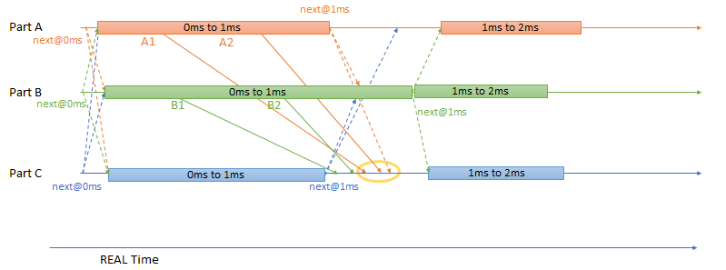

==========
Simulation
==========
..
  macros for internal use
..
  General macros
.. |ProductName| replace:: SIL Kit
..
  API references
.. |LifecycleServiceAPI| replace:: :cpp:class:`ILifecycleService<SilKit::Services::Orchestration::ILifecycleService>`
.. |TimeSyncServiceAPI| replace:: :cpp:class:`ITimeSyncService<SilKit::Services::Orchestration::ITimeSyncService>`
.. |SystemControllerAPI| replace:: :cpp:class:`ISystemController<SilKit::Experimental::Services::Orchestration::ISystemController>`
.. |SystemMonitorAPI| replace:: :cpp:class:`ISystemMonitor<SilKit::Services::Orchestration::ISystemMonitor>`
.. |CompleteSimulationStep| replace:: :cpp:func:`CompleteSimulationStep()<SilKit::Services::Orchestration::ITimeSyncService::CompleteSimulationStep()>`
.. |StartLifecycle| replace:: :cpp:func:`StartLifecycle()<SilKit::Services::Orchestration::ILifecycleService::StartLifecycle()>`

..
  Section references 
.. |LifecycleService| replace:: :ref:`Lifecycle Service<subsubsec:sim-lifecycle-lifecycleService>`
.. |TimeSyncService| replace:: :ref:`Time Synchronization Service<subsubsec:sim-lifecycle-timeSyncService>`
.. |SystemController| replace:: :ref:`System Controller<subsubsec:sim-lifecycle-systemController>`
.. |SystemMonitor| replace:: :ref:`System Monitor<subsubsec:sim-lifecycle-systemMonitor>`

..
  Reference implementations, etc.
.. |SilKitSystemController| replace:: :ref:`SIL Kit System Controller Utility<sec:util-system-controller>`

.. contents::
   :local:
   :depth: 3

The following chapter explains how a simulation using the |ProductName| works.
It first introduces the properties that affect the participants' behavior towards other participants.
Then, the lifecycle of individual simulation participants and the overall simulation are detailed.
Afterwards, details about a simulation run with synchronized participants are presented.
The chapter closes with details about the middleware that the reference implementation of the |ProductName| uses.

.. _sec:sim-types:

Properties of Participants
==========================

Generally, a |ProductName| participant can communicate with other participants without knowledge about their existence.
However, participants can register a :cpp:func:`SetParticipantConnectedHandler()<SilKit::Services::Orchestration::ISystemMonitor::SetParticipantConnectedHandler()>` callback that notifies them once a new participant connects.
Analogously, they can register a :cpp:func:`SetParticipantDisconnectedHandler()<SilKit::Services::Orchestration::ISystemMonitor::SetParticipantDisconnectedHandler()>` callback that notifies them when a participant disconnects.

However, participants can also use a lifecycle service that allows them to coordinate their startup and shutdown phase with other participants (see :ref:`Lifecycle Coordination Between Participants<sec:sim-lifecycle-management>`).
In addition, participants with a lifecycle can use the virtual time synchronization (see :ref:`Synchronized Simulation Run<sec:sim-synchronization>`).

.. _sec:sim-lifecycle-management:

Lifecycle Management
=====================

The |ProductName| provides lifecycle management for individual participants and the overall simulation.
The following first introduces means to observe and control the lifecycle.
Afterwards, the lifecycle of synchronized participants and the lifecycle of the overall simulation are introduced.

Lifecycle Control
------------------

There are two levels of granularity when it comes to lifecycle management: a local lifecycle that affects the state of an individual participant and a simulation-wide system Lifecycle.
The following introduces the three components that can affect and observe the individual and global lifecycle.

.. _subsubsec:sim-lifecycle-lifecycleService:

Lifecycle Service
~~~~~~~~~~~~~~~~~
The |LifecycleServiceAPI| interface allows each participant to access various functions related to its lifecycle.
Users can register callbacks that trigger once a participant reaches certain states.
Available callbacks are :cpp:func:`SetCommunicationReadyHandler()<SilKit::Services::Orchestration::ILifecycleService::SetCommunicationReadyHandler()>`, :cpp:func:`SetStopHandler()<SilKit::Services::Orchestration::ILifecycleService::SetStopHandler()>`, and :cpp:func:`SetShutdownHandler()<SilKit::Services::Orchestration::ILifecycleService::SetShutdownHandler()>`.
Further, the lifecycle service provides access to the |TimeSyncServiceAPI| interface, which grants access to the virtual time synchronization (see below).
If this service is not used, an additional :cpp:func:`SetStartingHandler()<SilKit::Services::Orchestration::ILifecycleService::SetStartingHandler()>` can be registered that notifies users once a simulation starts.
Once all needed controllers are registered and, if needed, the time synchronization service was retrieved and configured, the participants' lifecycle can be published by calling |StartLifecycle| (see :ref:`Lifecycle Coordination Between Participants<sec:sim-lifecycle-syncParticipants>`).

.. _subsubsec:sim-lifecycle-timeSyncService:

Time Synchronization Service
~~~~~~~~~~~~~~~~~~~~~~~~~~~~
The |TimeSyncServiceAPI| interface allows users to set a simulation step, which is important for participants with virtual time synchronization.
A simulation step defines the operations that are repeatedly performed in the interval of the simulation step size.
The simulation step as well as the initial step size are configured via :cpp:func:`ITimeSyncService::SetSimulationStepHandler()<SilKit::Services::Orchestration::ITimeSyncService::SetSimulationStepHandler()>`

.. _subsubsec:sim-lifecycle-systemMonitor:

System Monitor
~~~~~~~~~~~~~~
To observe the state transitions of other participants, users first need to retrieve the |SystemMonitorAPI| interface via :cpp:func:`CreateSystemMonitor()<SilKit::IParticipant::CreateSystemMonitor()>`.
Afterwards, they can register a participant status callback via :cpp:func:`AddParticipantStatusHandler()<SilKit::Services::Orchestration::ISystemMonitor::AddParticipantStatusHandler()>`.
In addition, users can register a callback for changes of the overall system state via :cpp:func:`AddSystemStateHandler()<SilKit::Services::Orchestration::ISystemMonitor::AddSystemStateHandler()>`.
The system state corresponds to the earliest state of all required participants.
For example, two Participants A and B are required. A is in state :cpp:enumerator:`ReadyToRun<SilKit::Services::Orchestration::ParticipantState::ReadyToRun>` and B is in :cpp:enumerator:`Running<SilKit::Services::Orchestration::ParticipantState::Running>`, then the system state would be :cpp:enumerator:`ReadyToRun<SilKit::Services::Orchestration::SystemState::ReadyToRun>` (as Running follows ReadyToRun).

.. _subsubsec:sim-lifecycle-systemController:

System Controller
~~~~~~~~~~~~~~~~~
.. warning::
  The System Controller is experimental and might be changed or removed in future versions of the SIL Kit.

The |SystemControllerAPI| interface allows users to set system-wide simulation parameters, such as which participants 
are required for a simulation, as well as signal commands that are processed by all participants with a 
lifecycle (see :doc:`System Controller<../api/systemcontroller>` for details).

.. admonition:: Note

    A coordinated participant must be required, or otherwise the simulation will enter an error state.

.. _sec:sim-lifecycle-syncParticipants:

Lifecycle Coordination Between Participants
--------------------------------------------

Each participant has an independent lifecycle that other participants can observe through the |SystemMonitor|.

.. _label:sim-lifecycle:
.. figure:: ../_static/ParticipantLifecycle_3.png
   :alt: : Participant state machine
   :align: center
   :width: 800

   : |ProductName| participant state machine.

A participant enters the distributed state machine by calling |StartLifecycle|.
This will cause the |LifecycleService| to announce its state as :cpp:enumerator:`ServicesCreated<SilKit::Services::Orchestration::ParticipantState::ServicesCreated>`, indicating that all services were created and announced to other participants.

A participant that uses the lifecycle service may choose to coordinate its state with other participants.
In that case, they will align their participant state based on the current system state until they reach :cpp:enumerator:`CommunicationInitialized<SilKit::Services::Orchestration::ParticipantState::CommunicationInitialized>`.
Once the system state also changes to CommunicationInitialized, the communication between all participants via :cpp:class:`DataPublisher<SilKit::Services::PubSub::IDataPublisher>` and :cpp:class:`DataSubscriber<SilKit::Services::PubSub::IDataSubscriber>` is possible.
This information is propagated to the user if they registered the callback via :cpp:func:`SetCommunicationReadyHandler()<SilKit::Services::Orchestration::ILifecycleService::SetCommunicationReadyHandler()>`.
Once the callback is finished, the participant state changes to :cpp:enumerator:`ReadyToRun<SilKit::Services::Orchestration::ParticipantState::ReadyToRun>`.
The participant will wait for the system state to change to :cpp:enumerator:`ReadyToRun<SilKit::Services::Orchestration::SystemState::ReadyToRun>` as well and then proceeds to the :cpp:enumerator:`Running<SilKit::Services::Orchestration::ParticipantState::Running>` state.

During the execution of a ``CommunicationReadyHandler``, the network communication of the participant is blocked. Therefore, it is impossible to exchange information with other participants during the execution of a ``CommunicationReadyHandler``.
If it is necessary to exchange information during the ``CommunicationInitialized`` state, :cpp:func:`SetCommunicationReadyHandlerAsync()<SilKit::Services::Orchestration::ILifecycleService::SetCommunicationReadyHandlerAsync()>` and :cpp:func:`CompleteCommunicationReadyHandlerAsync()<SilKit::Services::Orchestration::ILifecycleService::CompleteCommunicationReadyHandlerAsync()>` can be used.
:cpp:func:`SetCommunicationReadyHandlerAsync()<SilKit::Services::Orchestration::ILifecycleService::SetCommunicationReadyHandlerAsync()>` signals that the ``CommunicationInitialized`` state has been reached. After its execution, a participant is still in the ``CommunicationInitialized`` state and can exchange information.
After :cpp:func:`CompleteCommunicationReadyHandlerAsync()<SilKit::Services::Orchestration::ILifecycleService::CompleteCommunicationReadyHandlerAsync()>` is called, the participants state will switch to participant state changes to :cpp:enumerator:`ReadyToRun<SilKit::Services::Orchestration::ParticipantState::ReadyToRun>`.

Participants that coordinate their state but do not use the virtual time synchronization can register a :cpp:func:`SetStartingHandler()<SilKit::Services::Orchestration::ILifecycleService::SetStartingHandler()>`, which indicates that the synchronized participants will start the virtual time synchronization and thus the simulation.
This callback does not block the other participants and should only be used to start timers etc., it will trigger when the state transition to :cpp:enumerator:`Running<SilKit::Services::Orchestration::ParticipantState::Running>` is imminent.

Participants may also choose not to coordinate their state with other participants.
In this case, their state will transition to the Running phase without waiting for any system states.
They still receive the ``CommunicationReady`` callback before changing to :cpp:enumerator:`ReadyToRun<SilKit::Services::Orchestration::ParticipantState::ReadyToRun>`, but the communication guarantee does not apply.

Participants that use the virtual time synchronization repeatedly execute their registered simulation steps while advancement of time is handled by the middleware implementation.
If a participant temporarily cannot advance the simulation, e.g., because a debugger is attached to investigate its internal state, a participant can be put into the :cpp:enumerator:`Paused<SilKit::Services::Orchestration::ParticipantState::Paused>` state.

Generally, any participant can stop its simulation run by calling :cpp:func:`Stop()<SilKit::Services::Orchestration::ILifecycleService::Stop()>`.
If the participant is part of the required participants of a simulation, all other coordinated participants will also stop their simulation.
Please note that participants that are not coordinated must call stop by themselves to end their simulation run regularly.

Coordinated participants will also stop their simulation if the system state changes to :cpp:enumerator:`Stopping<SilKit::Services::Orchestration::ParticipantState::Stopping>`.
A callback registered via :cpp:func:`SetStopHandler()<SilKit::Services::Orchestration::ILifecycleService::SetStopHandler()>` can be used to detect the state transition and perform a collection of simulation results.
Once the callback execution is finished, the participant will change its state to :cpp:enumerator:`Stop<SilKit::Services::Orchestration::ParticipantState::Stop>`.
Afterwards, they transition to the ``ShuttingDown`` state, call the :cpp:func:`SetShutdownHandler()<SilKit::Services::Orchestration::ILifecycleService::SetShutdownHandler()>` and transition to the ``Shutdown`` state.

Whenever a participant encounters an error from which it cannot recover, it switches to the :cpp:enumerator:`Error<SilKit::Services::Orchestration::ParticipantState::Error>` state to indicate this situation to the system.
Users can manually trigger a transition to the error state and provide more information about the cause by calling :cpp:func:`ReportError()<SilKit::Services::Orchestration::ILifecycleService::ReportError()>`.
In some situations, a lifecycle service automatically enters the error state, e.g., when an uncaught exception is thrown in a callback.
A participant can only recover from the :cpp:enumerator:`Error<SilKit::Services::Orchestration::ParticipantState::Error>` state in one way: by shutting down.

All participants can also be forced to end their lifecycle by calling :cpp:func:`AbortSimulation()<SilKit::Experimental::Services::Orchestration::ISystemController::AbortSimulation()>` from any participant.
This will trigger the ``Abort`` callback, which indicates that the simulation was aborted and provide the participant state that was active when the abort event was received.

.. _subsec:sim-lifecycle:

Simulation-wide Lifecycle (System State)
-----------------------------------------

The lifecycle of the overall simulation is derived from the states of a defined set of participants.
Changes to the system state can be observed via the System Monitor.

The set of participants that define the system state must be defined via :cpp:func:`SetWorkflowConfiguration()<SilKit::Experimental::Services::Orchestration::ISystemController::SetWorkflowConfiguration()>` before the simulation is started (see :ref:`above<subsubsec:sim-lifecycle-systemController>` for details).
The system state is defined as follows:

#. If any required participant is not available, the system state is :cpp:enumerator:`Invalid<SilKit::Services::Orchestration::ParticipantState::Invalid>`.

#. If all required participants are in the same state, the system state will also be in this state. For example, if all required participants are in the state :cpp:enumerator:`Running<SilKit::Services::Orchestration::ParticipantState::Running>`, the system state is :cpp:enumerator:`Running<SilKit::Services::Orchestration::SystemState::Running>` too.

#. If not all required participants are in the same state, the 'earliest' state is used. For example, if a required participant 'A' is in :cpp:enumerator:`CommunicationInitialized<SilKit::Services::Orchestration::ParticipantState::CommunicationInitialized>` and a required participant 'B' is in :cpp:enumerator:`ReadyToRun<SilKit::Services::Orchestration::ParticipantState::ReadyToRun>`, then the system state is :cpp:enumerator:`CommunicationInitialized<SilKit::Services::Orchestration::SystemState::CommunicationInitialized>`.

The main exception to this rule are the :cpp:enumerator:`Paused<SilKit::Services::Orchestration::ParticipantState::Paused>`, :cpp:enumerator:`Error<SilKit::Services::Orchestration::ParticipantState::Error>`, and :cpp:enumerator:`Stopping<SilKit::Services::Orchestration::ParticipantState::Stopping>` states, which can be regarded as dominant states.
For example, if just one participant enters the :cpp:enumerator:`Error<SilKit::Services::Orchestration::ParticipantState::Error>` state, the system state will be change to :cpp:enumerator:`Error<SilKit::Services::Orchestration::SystemState::Error>` as well.

The system state follows state transitions in a lazy manner.
This means that the system state remains the old state until all relevant participants have reached the new state.
For example, the system state remains :cpp:enumerator:`ServicesCreated<SilKit::Services::Orchestration::SystemState::ServicesCreated>` until all relevant participants have achieved the :cpp:enumerator:`CommunicationInitializing<SilKit::Services::Orchestration::ParticipantState::CommunicationInitializing>` state.

In all cases that do not match any of the above, the system state will be regarded as :cpp:enumerator:`Invalid<SilKit::Services::Orchestration::SystemState::Invalid>`.
This should typically not occur.

.. _sec:sim-synchronization:

Synchronized Simulation Run
===========================

The following first gives a general overview of a simulation run using the |ProductName|.
Afterwards, possibilities to configure the simulation step length of a simulation step and to define the simulation step that is being executed are introduced.
The last part details what time information |ProductName| clients provide, depending on their synchronization mode.

.. admonition:: Note

    A mixed operation mode, where some participants operate synchronized and some unsynchronized,
    is not supported. Therefore, all participants of a simulation must either be synchronized or unsynchronized.

.. _subsec:sim-overview:

Simulation Overview
-------------------
A |ProductName| simulation is designed as a discrete-event simulation.
This means, that each event of a participant occurs at a distinct point in time.
Synchronized participants exchange information about the next point in time at which they intend to execute their *simulation step*.
Based on this information they can infer if they can trigger their next simulation step or if they still need to wait for other participants to finish their steps.
Each participant executes its simulation step periodically.
The simulation time between the execution must be set when registering the simulation step.

Configuration of the Simulation Step
------------------------------------
Each synchronized participant **must** define a simulation step that will be executed at the beginning of the interval defined by the simulation step size.
The size of the simulation step is provided when setting the simulation step handler.
Users can provide the simulation step either synchronously or asynchronously.
The synchronous simulation step is set by calling :cpp:func:`SetSimulationStepHandler()<SilKit::Services::Orchestration::ITimeSyncService::SetSimulationStepHandler()>`
and providing the simulation step to be executed as a delegate function.
Note that the simulation step is not necessarily executed on the main thread of the application.
After the execution of the simulation step is finished, the other participants are informed about the next point in time at which the participant intends to execute its next step.
Users can exchange the simulation step by calling ``SetSimulationStepHandler`` again, but they cannot intervene during its execution.

Sometimes, it may be desirable to have more control about the simulation step execution.
In these cases, the asynchronous simulation step execution may be preferable.

Similar to the synchronous case, an asynchronous simulation step is set by calling :cpp:func:`SetSimulationStepHandlerAsync()<SilKit::Services::Orchestration::ITimeSyncService::SetSimulationStepHandlerAsync()>`.
It is executed at the start of each simulation step, but it does not automatically signal other participants that the current simulation step is finished.
Instead, the user is required to call |CompleteSimulationStep| to signal the completion of the current simulation step.
This enables the user to have fine-grained control over the synchronous simulation progress.
Also, this allows two participants to communicate without increasing the simulation time.

.. admonition:: Note

    Asynchronous simulation steps are non-blocking.
    This means that it is possible that callbacks from received messages are triggered concurrently during the execution of the simulation step.
    Users need to make sure that their data is protected against concurrent read/write access.

.. admonition:: Note

    Calling |CompleteSimulationStep| will advance the simulation time regardless of the execution state of the asynchronous simulation step.

.. _subsec:sim-sync-timestamps:

Timestamps in Messages
----------------------

Each sent bus event is annotated with a timestamp, at which it was sent.
The timestamp is set automatically by the |ProductName| client.
Users do not have to (and should not try to) manually set the timestamp of a message.
Depending on the mode of the participant (synchronized/unsynchronized) and whether the network is managed by a network simulator, the timestamp's meaning and precision may differ.
If a network simulator is available for a given network, it takes precedence of the timestamp control and overrides the timestamps of any bus message.

The following table provides an overview of the behavior, if no network simulator is available.

.. list-table:: : Message timestamp by synchronization mode
   :widths: 30 35 35
   :header-rows: 1

   * - 
     - Unsynchronized (Sender)
     - Synchronized (Sender)
   * - Unsynchronized (Receiver)
     - Undefined
     - Use timestamp of own simulation step
   * - Synchronized (Receiver)
     - Undefined
     - Use timestamp of sender

.. _subsec:sim-syncExample:

SIL Kit Middleware
------------------

The provided implementation of the |ProductName| headers uses an internal middleware that is provided with the |ProductName|.
Within it, all participants exchange their messages via direct messaging based on TCP connections or Unix domain sockets.

The internal middleware guarantees message delivery to always be in-order.
This enables the usage of a distributed synchronization algorithm.
:numref:`label:sim-messageDelivery` shows the synchronization algorithm:

.. _label:sim-messageDelivery:

   : |ProductName| delivery of messages.

The algorithm reports the start time of the next due simulation step to all other participants (``next@`` messages in the figure).
By taking the other participants' next simulation step into account, a participant knows when it can safely execute its next simulation step.
That is, when there are no more simulation steps of other participants with an earlier timestamp than its own next simulation step.
