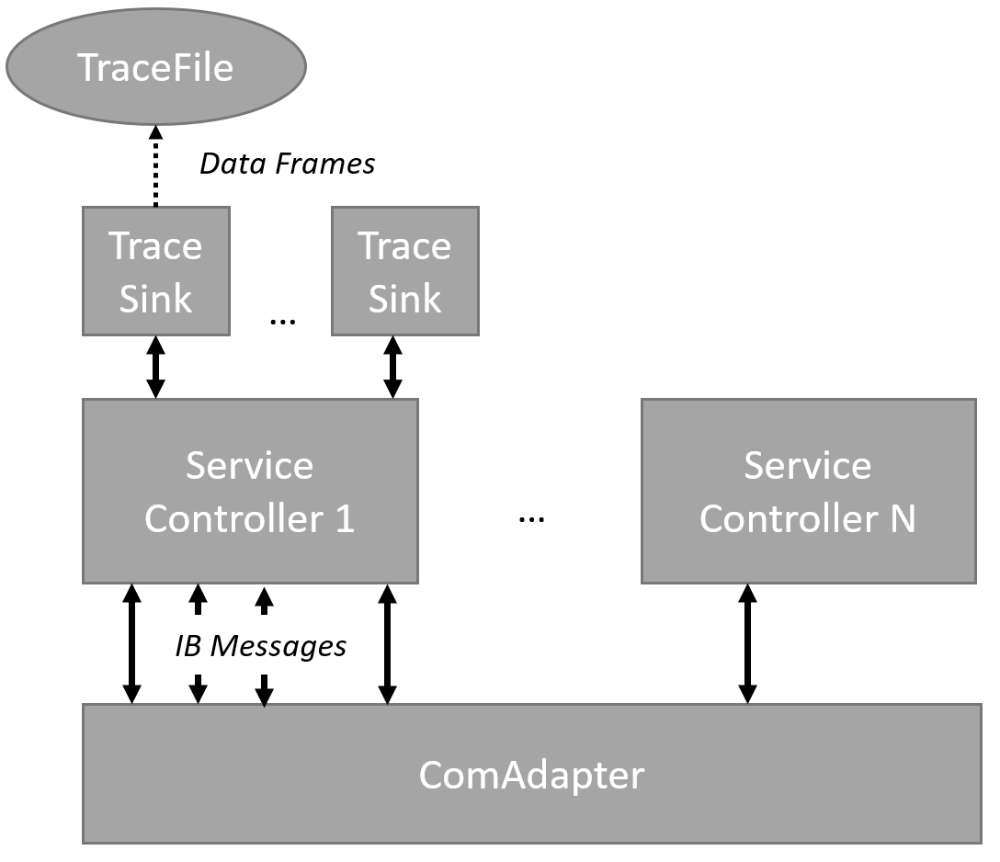
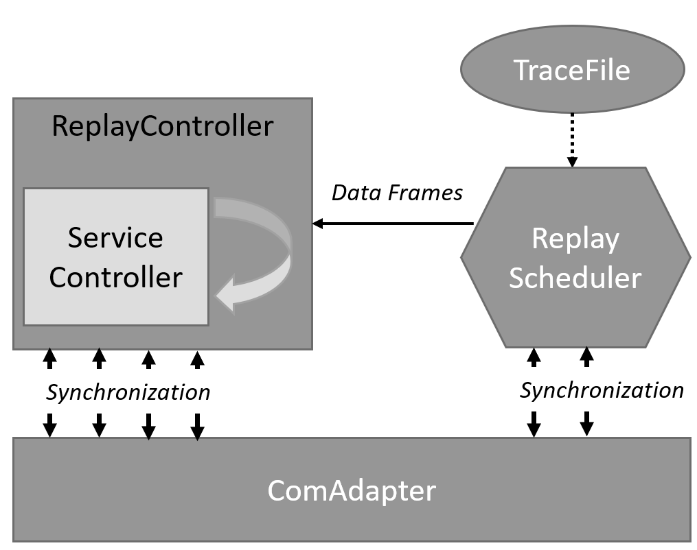

======================
VIB Trace and Replay
======================

.. |MDF4| replace:: :ref:`MDF4<mdf4tracing>`
.. |PCAP| replace:: :ref:`PCAP<sec:api-ethernet-tracing>`

This document describes the tracing and replaying feature of the Vector
Integration Bus.
The tracing feature enables users of the VIB to store bus frames and generic data types 
unmodified, including accurate simulation time stamps, into binary trace files.
This enables offline analysis, debugging and also replaying of messages into
live simulations.
Multiple trace file formats are supported.
PCAP is supported natively by the IntegrationBus and the MDF4 file format is supported by the :ref:`VIBE-MDF4Tracing<mdf4tracing>` extension.

.. contents:: :local:
   :depth: 1

.. _sec:replay-overview:

Overview
~~~~~~~~~~~~~
This section introduces the technical terms used in the following sections.
For VIB specific terminology, please refer to the :ref:`generic VIB introduction<sec:quickstart-terminology>`.

.. _table-terminology:

.. list-table:: Terminology
   :widths: 20 80
   :header-rows: 1
   
   * - Term
     - Description
   * - Trace Message
     - An IntegrationBus data type referring to a bus frame or generic data
       message, which can be serialized and deserialized.
   * - Trace Sink
     - Allows saving Trace Messages to permanent storage.
   * - Trace File
     - The permanent storage in a well-defined, standardized file format which is used by a trace
       sink to persist trace messages.
   * - PCAP
     - A widely used file format originally designed for ethernet traces.
       Allows encoding a stream of ethernet frames with associated time stamps, but no further
       meta data.
   * - MDF
     - An industry standard file format which allows storing multiple data
       streams of different types of bus frames.
       The standard supports LIN, Ethernet, CAN and FlexRay among others.
       Extensive meta data can be stored in this file format, including trace
       direction (receive, transmit) and the acquisition path (identifying the
       source of the data frames).
   * - Replay Channel
     - Refers to a data stream inside of a Trace File.
       The data stream is usually encoded with meta data that allows identifying
       a VIB bus or a controller, to which a data stream should be attached during
       replay.
   * - Replay Controller
     - A bus or service controller that implements replaying specific behavior.
       This includes access control to user APIs based on the replay
       configuration.
   * - Replay Scheduler
     - The task responsible for dispatching Trace Messages during a replaying
       simulation run.
       It also creates and configures Replay Controllers transparently to 
       users of the VIB API.

The following :ref:`section<sec:replay-getting_started>` gives a short usage
example.
The configuration and usage limitations are detailed in section
:ref:`sec:replay`.
And the design and implementation is discussed in section
:ref:`sec:replay-architecture`.

.. admonition:: Note
    
   MDF4 replaying is currently limited to trace files generated by the VIB.
   The MDF4 file format allows encoding multiple possible channels, and the
   mapping between IntegrationBus participants and the channel layout is
   currently hard-coded.

.. _sec:replay-getting_started:

Getting Started
~~~~~~~~~~~~~~~
In this tutorial we are going to use one of the :doc:`demo applications</usage/demos>` and demonstrate the usage
of the tracing and replaying features.
Make sure you follow the instructions to build the demo applications in :ref:`sec:build-demos`.
You should also extract the :ref:`VIBE-MDF4Tracing<mdf4tracing>` distribution
packages for your development environment.
We use the Ethernet demo as an example, but any of the other demos will also work, with limitations detailed in :ref:`the replaying overview<sec:replay>`.

Our aim is to trace all bus messages on a service controller and replay the same messages into a live simulation.
Message data types that are suitable for tracing are listed in the
:ref:`support table<table-overview>`.
These data types map to specific bus frame types that are supported by standard MDF channels.
Internal IB data types like simulation control, synchronization and service specific auxiliary data types will not be traced.

Our task consists of the following steps:
First, we have to adjust the demo's configuration to contain :ref:`trace sinks<sec:cfg-participant-tracesink>` attached to a controller.
Then, the demo needs to run for some time to accumulate data frames and we need to shut it down cleanly, which will result in a valid trace file.
After creating the trace file, we need to change the configuration to use a *trace source* on a participant and adding a :ref:`replay config block<sec:cfg-participant-replay>` on a controller which utilizes the trace source.
Any subsequent simulation runs will use the data frames from the trace file on the controller instead of the data frames generated by the participant's process.

Tracing
^^^^^^^

The Ethernet demo's configuration consists of two participants, the *EthernetWriter*
taking an active role of sending, and the *EthernetReader* receiving messages
passively.
The tracing mechanism is located and configured on each participant
individually.
We need to specify at least one *Trace Sink* on a participant and enable it by using it  on at least one controller.
The following code block shows the changes to the demo's config:

.. code-block:: javascript
    :emphasize-lines: 10, 13-18
    
    "SimulationSetup": [
        "Participants": [
        {
            "Name" : "EthernetWriter",
            [...]
            "EthernetControllers":[
                {
                    "Name": "ETH0",
                    [...]
                    "UseTraceSinks": ["EthWriterSink"]
                }
            ],
            "TraceSinks": [
                {
                    "Name": "EthWriterSink",
                    "Type": "Mdf4File",
                    "OutputPath": "EthernetWriter.mdf4"
                }
            ]
        }
        ]
     ]

We instantiated one MDF4 trace sink and connected it to the ethernet controller
named "ETH0".
In case the VIBE-MDF4Tracing shared libraries are not in the current working
directory, you'll also need to put an appropriate *extension config* statement
in your configuration file, refer to
:ref:`the extension configuration section<sec:cfg-extension-configuration-overview>` for further information.
Tracing on ethernet controllers also supports the :ref:`PcapFile and PcapPipe trace
sink types<sec:cfg-participant-ethernet>`.
Please note that PCAP lacks meta information, such as the reception direction
(transmit/receive) and as such a replay will inject all ethernet messages into
the simulation that are part of the PCAP trace file.

Running the demo with this configuration will create the trace file in the specified output path.

.. admonition:: Warning
   
   Ensure that the simulation is stopped cleanly by issuing a simulation stop command using the IbSystemController process.
   Just stopping a participant process will result in damaged trace files, because the destructors and clean up routines
   necessary for finalizing a trace file are not called.

The resulting MDF4 file can be validated using the :ref:`vibe-mdfinfo<sec:vibe-mdfinfo>`
command line tool.
Currently, replaying a trace file is only supported on a participant and the controller the trace file was created on.
This limitation might be changed in the future.

Replaying
^^^^^^^^^^
The replaying of a trace file is enabled by specifying a :ref:`trace source<sec:cfg-participant-tracesource>` and
adding a :ref:`replay<sec:cfg-participant-replay>` configuration block to a controller.
The replay block establishes a link to the trace source, but also controls how
the data is used.

.. code-block:: javascript
    :emphasize-lines: 10-13, 16-21
    
    "SimulationSetup": [
        "Participants": [
        {
            "Name" : "EthernetWriter",
            [...]
            "EthernetControllers":[
                {
                    "Name": "ETH0",
                    [...]
                    "Replay" : {
                        "Direction": "Send",
                        "UseTraceSource": "Source1"
                    }
                }
            ],
            "TraceSources": [
                {
                    "Name": "Source1",
                    "Type": "Mdf4File",
                    "InputPath": "EthernetWriter.mdf4"
                }
            ]
        }
        ]
     ]

As shown in the code listing, the actual configuration statements are similar to
the one used for tracing.
When a replay block is declared on a controller, it's VIB communications will be
controlled by a replay controller which acts as a proxy.
Some of the EthernetController's data transmission APIs are disabled to allow replaying data on unmodified participants.
The "Direction" configuration statement can be either one of "Send", "Receive",
or "Both".
This will limit the replaying of trace messages with the specified direction
encoded.
For example, setting it to "Receive" will disable the normal reception of live
IntegrationBus messages via the callbacks listed in the :ref:`table<table-callbacks>`  and will inject ``EthMessages`` extracted from a trace file instead.

When starting the demo's participants, the simulation should start up and
continue as before, but depending on how many messages were traced in the
previous run, the reception of messages should stop once all trace messages are
sent.
However, the simulation should continue its execution.
A notable deviation from the previous run is that the *EthernetWriter* instance
should now always log a transmit ID of zero, because it's transmission API calls are disabled (due to the ``Direction: "Send"`` configuration).
The acknowledgement messages should continue with different transmit IDs, for
example:

.. code-block:: text

  << ETH Frame sent with transmitId=0
  >> ACK for ETH Message with transmitId=1 

This execution model allows using unmodified participants in a replay session,
without their cooperation or code changes.
The supported VIB data types and runtime behaviors are detailed in section
:ref:`sec:replay`.

.. _sec:replay:

Replaying Features
~~~~~~~~~~~~~~~~~~~~
The tracing and replaying functionality is built into the ComAdapter and its service controllers.
Users can trace data frames on the controllers of a participant or on simulated links of the :doc:`/vibes/networksimulator`.
This functionality is controlled by configuration statements in the :ref:`VIB configuration<sec:cfg-participant-tracing>`.

The replaying mechanism works by instantiating a replay controller that issues
calls to message transmission APIs on behalf of the user.
The replay controller also prevents any invocation of these APIs by the user.
This allows running unmodified participants in a simulation and replacing their
active communications with a replay of a previously recorded trace file.
Other IntegrationBus API calls are not prevented, as the trace message replay relies on the collaboration of
the user's application code, for example, for handling auxiliary data types or
simulation control messages.
In particular, data handlers registered by an application on a controller are still served on reception or sending replay data.

The following table details which replay and tracing modes are supported by each of the IntegrationBus service types.

.. _table-overview:

.. list-table:: Trace and Replaying Data Types Supported
   :width: 70%
   :widths: 10 10 1 1
   :header-rows: 1
   
   * - Service Type
     - Frame type
     - |MDF4|
     - |PCAP|
   * - CAN
     - ib::sim::can::CanMessage
     - X
     -

   * - LIN
     - ib::sim::lin::Frame
     - X
     - 

   * - Ethernet
     - ib::sim::eth::EthFrame
     - X
     - X

   * - FlexRay
     - ib::sim::fr::FrMessage
     - X
     - 

   * - IO Ports
     - ib::sim::io::AnalogIoMessage

       ib::sim::io::DigitalIoMessage

       ib::sim::io::PatternIoMessage

       ib::sim::io::PwmIoMessage

     - X

       X

       X

       X
     - 

   * - GenericMessage
     - ib::sim::generic::GenericMessage
     - X
     -

With the following limitations and  notes:

- |PCAP| is supported only on ethernet controllers.
  It is not possible to encode the transmit directions in this file format, which
  limits replaying of PCAP messages to replaying all messages included in the
  trace file.

- Replaying on :ref:`Lin<sec:cfg-participant-lin>` is only supported on the Master
  controller of the simulated bus.

- Replaying :ref:`FlexRay<sec:cfg-participant-flexray>` messages is only supported
  using the :doc:`VIBE Network Simulator</vibes/networksimulator>`.
  The startup and synchronization sequence is not part of the traces which only
  contains actual data frames.
  After a stable synchronous cycle has been established, the sequence
  of the actual data frames will be the same as in the trace file.

.. admonition:: Note -- FlexRay Replaying
    
  Please note, that the startup and synchronization sequence is not part of the
  replay, and as such timestamps might deviate between a replay and the trace
  file.
  However, the order of messages in the replay is similar to the trace file.

- Generic data types, such as Generic Messages and I/O ports are encoded in a
  Vector CANoe compatible way.
  They are encoded as SystemVariables and a MDF4 trace file is accompanied by a
  *.vsysvar* definition file.
  This definition file must be imported into the CANoe system variable
  environment, before the traced data can be manipulated natively in CANoe.

.. _sec:replay-modes:

Supported Replaying Modes
^^^^^^^^^^^^^^^^^^^^^^^^^
The replay configuration allows filtering the replay data based on the recorded
transmission's direction.
The goal is to allow replacing the active communications of a participant
without the need to modify and recompile the participant.
Please note, that only the listed methods in :ref:`the following table<table-methods>` are affected in their runtime behavior.
When the replay direction is set to :cpp:enum:`Direction::Both<ib::cfg::Replay::Direction::Both>`, then only data originating from a replay file will be issued to the controller.
That is, user invocations of the transmission APIs and reception of live VIB data messages will be disabled.

The following tables list the APIs affected by setting a :cpp:enum:`Replay::Direction<ib::cfg::Replay::Direction>` in a replay config block.
Data transmissions originating from user code will be inhibited if the configured replay direction is ``Send`` or ``Both``.
Registered user callbacks are served with Replay Messages if the configured direction is ``Receive`` or ``Both``.

.. _table-methods:

.. list-table:: User calls affected by ``Replay::Direction == Send``:
   :width: 70%
   :widths: 10 
   :header-rows: 1
   

   * - Method
   * - :cpp:func:`ib::sim::can::ICanController::SendMessage`
   * - :cpp:func:`ib::sim::lin::ILinController::SendFrame`
   * - :cpp:func:`ib::sim::lin::ILinController::SendFrameHeader`
   * - :cpp:func:`ib::sim::lin::ILinController::SetFrameResponse`
   * - :cpp:func:`ib::sim::eth::IEthController::SendMessage`
   * - :cpp:func:`ib::sim::eth::IEthController::SendFrame`
   * - :cpp:func:`ib::sim::fr::IFrController::ReconfigureTxBuffer`
   * - :cpp:func:`ib::sim::fr::IFrController::UpdateTxBuffer`
   * - :cpp:func:`ib::sim::io::IOutPort::Write`
   * - :cpp:func:`ib::sim::generic::IGenericPublisher::Publish`

.. _table-callbacks:

.. list-table:: User callbacks affected by ``Replay::Direction == Receive``:
   :width: 70%
   :widths: 10
   :header-rows: 1

   * - Handler type
   * - :cpp:type:`ib::sim::can::ICanController::ReceiveMessageHandler`
   * - :cpp:type:`ib::sim::lin::ILinController::FrameStatusHandler`
   * - :cpp:type:`ib::sim::eth::IEthController::ReceiveMessageHandler`
   * - :cpp:type:`ib::sim::fr::IFrController::MessageHandler`
   * - :cpp:type:`ib::sim::io::IInPort::CallbackT`
   * - :cpp:type:`ib::sim::generic::IGenericSubscriber::CallbackT`

.. _sec:replay-architecture:

Architecture
~~~~~~~~~~~~

The trace and replay mechanism is an extension to the existing :cpp:class:`IComAdapter<ib::mw::IComAdapter>`, and consists of several parts:

To have a consistent time base during the simulation and throughout the participant, an instance of :cpp:class:`ITimeProvider<ib::sim::sync::ITimeProvider>` is used.
It gives access to the current simulation time, or as a fallback the wall-clock time if no participant controller is configured.

The actual data flow of messages during tracing is achieved by the  *ITraceMessageSource* and *ITraceMessageSinks* interfaces.
A controller implementing the *ITraceMessageSource* allows attaching
*ITraceMessageSinks* which might be implemented in a VIB extension. 
The VIB configuration allows attaching several trace sinks to controllers.
The controllers have specific trace points where messages are pushed into the sinks.

The last building block is the *ReplayScheduler*, which combines the time
keeping of the time provider with the replaying functionality of the replay data
controllers.
Controllers supporting replay implement the *IReplayDataController* interface,
which allows injecting traced messages into live simulations.

Tracing
^^^^^^^
The architecture of the tracing facility is shown in :ref:`the following
figure<figure:tracing>`.
The ComAdapter takes care of configuring controllers with their trace sinks upon
creation.
If the ComAdapter has a participant controller, then the virtual simulation time will be used in a time provider instance.
This time provider is used to get the current time stamp when messages are pushed to a trace sink.

.. _figure:tracing:

   The Message Tracing Facility.

Trace sinks implement the :cpp:class:`ITraceMessageSink<ib::extensions::ITraceMessageSink>` interface.
For MDF4 they are implemented in a shared library, which is automatically loaded
by the VIB extension mechanism.
The service controllers contain trace points, which allows capturing
the message data along with meta information like the direction of the
communication and the current time stamp.

Trace File Layout
^^^^^^^^^^^^^^^^^
The traced messages are encoded in binary files for later use.
PCAP files only support a single logical data stream and only contain raw
ethernet frames without meta data like the participant ID and controller ID from
which the frame originates from.
MDF4 allows encoding several logical data streams, referred to as channels, for
each controller of a bus.
It also has rich meta data facilities which allow encoding additional
information like the original VIB configuration, the transmission direction of a frame and information identifying the acquisition source within the VIB simulation setup.

The meta data is used by the *ReplayScheduler* to find an appropriate replay channel in a given input trace file and attach this trace data
source to a *ReplayController*.

Replaying
^^^^^^^^^^
When a replay configuration is active, a *ReplayScheduler* is instantiated.
Based on the configuration it creates replay controllers, configures them,
and attaches them to a trace file with a matching logical data stream, known as a replay channel.

   The Message Replaying Facility.

A replay controller wraps an existing, unmodified controller and implements the
*IReplayDataController* interface for it.
The replay controller uses the controller's configuration to determine which of
the active transmission APIs should be allowed.
It also exposes the *ReplayMessage* method used by the replay scheduler to inject
actual data messages into the controller.

At simulation start, the ReplayScheduler will start its operation.
While the ReplayControllers prevent the participant's communication, as
described in :ref:`sec:replay`, the scheduler takes over the active
communication.
The scheduler will serve every replay controller in a round robin fashion.
For the current simulation time point and duration it will extract trace messages from the
controller's associated data stream, and will inject these messages on the
controller.

