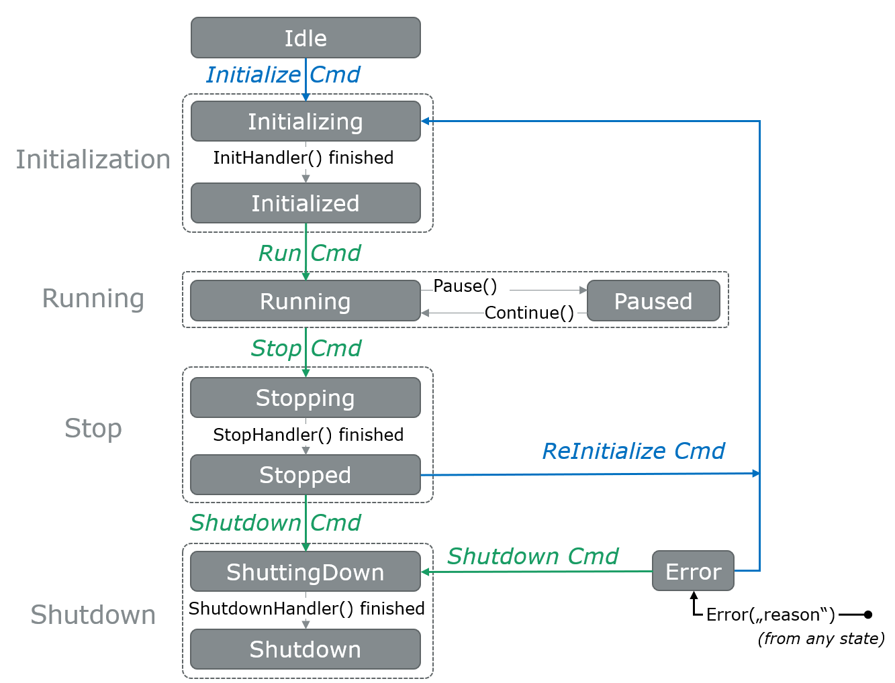

Simulation
**********
.. 
  macros for internal use
..
  General macros
.. |ProductName| replace:: Integration Bus
..
  API references
.. |ParticipantControllerAPI| replace:: :cpp:class:`IParticipantController<ib::mw::sync::IParticipantController>`
.. |SystemControllerAPI| replace:: :cpp:class:`ISystemController<ib::mw::sync::ISystemController>`
.. |SystemMonitorAPI| replace:: :cpp:class:`ISystemMonitor<ib::mw::sync::ISystemMonitor>`
.. |CompleteSimulationTask| replace:: :cpp:func:`CompleteSimulationTask()<ib::mw::sync::IParticipantController::CompleteSimulationTask()>`

.. 
  Section references 
.. |ParticipantController| replace:: :ref:`Participant Controller<subsubsec:sim-lifecycle-participantController>`
.. |SystemController| replace:: :ref:`System Controller<subsubsec:sim-lifecycle-systemController>`
.. |SystemMonitor| replace:: :ref:`System Monitor<subsubsec:sim-lifecycle-systemMonitor>`

..
  Reference implementations, VIBEs etc.
.. |IbSystemController| replace:: :ref:`VIB SystemController Utility<sec:util-system-controller>`
.. |VibeNetSim| replace:: :ref:`VIBE Network Simulator<chap:VIBE-NetSim>`

The following chapter explains, how a simulation using the |ProductName| works.
It first introduces the two modes, in which a simulation participant can run.
Then, the lifecycle of individual simulation participants and the overall simulation are detailed.
Afterwards, details about a simulation run with synchronized participants are presented.
The chapter closes with details about the middleware that the reference implementation of the |ProductName| uses.

.. _sec:sim-types:

Types of Simulation Participants
================================

When creating a participant instance, users must decide, what type of participant they want to instantiate regarding the participant's synchronization behavior.
There are two types of participants: unsynchronized and synchronized.
The type of a participant has an effect on their synchronization with other participants regarding the simulation state and the current simulation time, as well as the timestamps of messages.
The following table gives an overview of the differences between the participant types. The individual features are explained in more detail in the following sections.

.. list-table:: : Features by participant type
   :widths: 30 35 35
   :header-rows: 1

   * - Feature / Type
     - Unsynchronized
     - Synchronized
   * - Parameter in participant creation
     - isSynchronized = false
     - isSynchronized = true
   * - :ref:`Participant Lifecycle<sec:sim-lifecycle-management>`
     - No lifecycle
     - Full lifecycle support
   * - :ref:`Simulation Lifecycle<subsec:sim-lifecycle>`
     - No contribution to simulation state
     - May contribute to simulation state
   * - :ref:`Message timestamps<subsec:sim-sync-timestamps>` 
     - Based on wall clock
     - Based on distributed simulation time
   * - Send order
     - Messages are sent in-order
     - Messages are sent in-order
   * - Receive order
     - Message timestamps of individual participants are monotonous
      
       No monotonicity ensured across multiple participants
     - Message timestamps of individual participants are monotonous

       No monotonicity ensured across multiple participants

.. _sec:sim-lifecycle-management:

Lifecycle Management
====================
.. admonition:: Note
  
   The following describes the current behavior and will change in the foreseeable future.
   
The |ProductName| provides lifecycle management for individual synchronized participants and the overall simulation.
The following first introduces means to observe and control the lifecycle. 
Afterwards, the lifecycle of synchronized participants and the lifecycle of the overall simulation are introduced.

Lifecycle Control
-----------------
.. Note::
  
   It is currently possible to instantiate a participant controller with an unsynchronized participant. 
   However, this should be avoided, as unsynchronized participants neither have an explicit lifecycle nor do they participate in the simulation time synchronization.

There are two levels of granularity when it comes to lifecycle management: a local lifecycle that affects the state of an individual participant and a simulation wide lifecycle.
The following introduces the three components that can affect and observe the individual and global lifecycle.

.. _subsubsec:sim-lifecycle-participantController:

**Participant controller:**
The |ParticipantControllerAPI| interface allows each synchronized participant to access various functions related to its lifecycle.
Users can register callbacks that trigger whenever a participant's state changes.
Available callbacks are :cpp:func:`SetInitHandler()<ib::mw::sync::IParticipantController::SetInitHandler()>`, :cpp:func:`SetStopHandler()<ib::mw::sync::IParticipantController::SetStopHandler()>`, and :cpp:func:`SetShutdownHandler()<ib::mw::sync::IParticipantController::SetShutdownHandler()>`. 
Further, the participant controller allows users to set a simulation task, which is mandatory for synchronized participants.
A simulation task is a function that is triggered at the beginning of each simulation step of a participant.
Once all needed controllers are registered and a simulation task was set, the participant's :ref:`current state (Idle)<sec:sim-lifecycle-syncParticipants>` can be published by either calling :cpp:func:`Run()<ib::mw::sync::IParticipantController::Run()>` or :cpp:func:`RunAsync()<ib::mw::sync::IParticipantController::RunAsync()>`.

.. _subsubsec:sim-lifecycle-systemMonitor:

**System monitor:**
To observe the state transitions of other participants, users first need to retrieve the |SystemMonitorAPI| interface via :cpp:func:`GetSystemMonitor()<ib::mw::IComAdapter::GetSystemMonitor()>`.
Afterwards, they can register a participant status callback via :cpp:func:`RegisterParticipantStatusHandler()<ib::mw::sync::ISystemMonitor::RegisterParticipantStatusHandler()>`
In addition, users can register a callback for changes of the overall system state via :cpp:func:`RegisterSystemStateHandler()<ib::mw::sync::ISystemMonitor::RegisterSystemStateHandler()>`.
This is a convenience function, as the system state could be manually calculated based on the state of each participant.

.. _subsubsec:sim-lifecycle-systemController:

**System controller:**
The |SystemControllerAPI| interface allows users to signal state transitions to all or individual participants.
The remainder of this documentation refers to these signals as *system commands*.
Although any participant has a system controller and could therefore steer the simulation, we recommend to either dedicate one participant to take care of the simulation's lifecycle management or to define a participant that will do this.
Please note that the system controller interface does not provide any means to automatically handle states of individual participants or the entire simulation.
We provide a reference implementation that provides all necessary state transitions for a properly working simulation (see |IbSystemController| for details). 

.. _sec:sim-lifecycle-syncParticipants:

Lifecycle of Synchronized Participants
--------------------------------------
Each synchronized participant has an independent lifecycle that other participants can observe through the |SystemMonitor|.
The participant's lifecycle (see :numref:`label:sim-lifecycle`) can be divided into four stages: initialization, running, stop, and shut down.
Transitions between those stages are initiated by the |SystemController|.
For all phases, the |ParticipantController| allows setting callbacks that are executed in that phase.
The Init-, Stop-, and ShutdownHandlers are executed when entering the new phase.
During the Running state, the provided simulation task is executed repeatedly (see :ref:`Simulation Synchronization<sec:sim-synchronization>` for details).

..
  ../_static/ParticipantStateMachine.png
  ../_static/stateMachine_mermaid-diagram_v4.svg
.. _label:sim-lifecycle:

   : |ProductName| participant state machine.

A participant enters the distributed state machine by either calling :cpp:func:`Run()<ib::mw::sync::IParticipantController::Run()>` or :cpp:func:`RunAsync()<ib::mw::sync::IParticipantController::RunAsync()>`. 
This will cause the |ParticipantController| to anounce its state as :cpp:enumerator:`Idle<ib::mw::sync::ParticipantState::Idle>`, indicating that it is ready for initialization. 
Before calling Run() or RunAsync(), the participant state is unavailable to all other participants. 

Each participant is initialized individually by receiving a system command from a |SystemController|'s :cpp:func:`Initialize()<ib::mw::sync::ISystemController::Initialize()>` call.

After all participants have been initialized, the simulation is started by issuing the system command :cpp:func:`Run()<ib::mw::sync::ISystemController::Run()>`.  
While the system is in the :cpp:enumerator:`Running<ib::mw::sync::SystemState::Running>` state, the participants repeatedly execute their registered SimTask while advancement of time is handled by the middleware implementation.

If a participant temporarily cannot advance the simulation, e.g., because a debugger is attached to investigate its internal state, a participant can be put into the :cpp:enumerator:`Paused<ib::mw::sync::ParticipantState::Paused>` state.

A simulation run is finished by issuing the system command :cpp:func:`Stop()<ib::mw::sync::ISystemController::Stop()>`. 
A callback registered via :cpp:func:`SetStopHandler()<ib::mw::sync::IParticipantController::SetStopHandler()>` can be used to perform a collection of simulation results. 
Once all participants have successfully executed their StopHandler and the system is in state :cpp:enumerator:`Stopped<ib::mw::sync::SystemState::Stopped>`, a |SystemController| can either end the simulation via :cpp:func:`Shutdown()<ib::mw::sync::ISystemController::Shutdown()>` or prepare it via :cpp:func:`ReInitialize()<ib::mw::sync::ISystemController::ReInitialize()>` for another simulation run. 
In the latter case, simulation time is reset to zero.

Whenever a participant encounters an error from which it cannot recover, it switches to the :cpp:enumerator:`Error<ib::mw::sync::ParticipantState::Error>` state to indicate this situation to the system. 
Users can manually trigger a transition to the error state and provide more information about the cause by calling :cpp:func:`ReportError()<ib::mw::sync::IParticipantController::ReportError()>`. 
In some situations, a participant controller automatically enters the error state, e.g., when an uncaught exception is thrown in a callback. 
A participant can only recover from the :cpp:enumerator:`Error<ib::mw::sync::ParticipantState::Error>` state in two ways: Reinitialization or Shutdown.

.. _subsec:sim-lifecycle:

Simulation Lifecycle
--------------------
The lifecycle of the overall simulation is derived from the states of a defined set of synchronized participants.
Changes to the system state can be observed via the SystemMonitor.

The set of participants that define the system state must be defined via :cpp:func:`ISystemController::SetRequiredParticipants()<ib::mw::sync::ISystemController::SetRequiredParticipants()>` before the simulation is started (see :ref:`above<subsubsec:sim-lifecycle-systemController>` for details).
The system state is defined as follows:
If all relevant participants are in the same state, the system state will also be in the same state.
For example, if all participants are in the state :cpp:enumerator:`Running<ib::mw::sync::ParticipantState::Running>`, the system state is :cpp:enumerator:`Running<ib::mw::sync::SystemState::Running>` too.
The main exception to this rule are the :cpp:enumerator:`Paused<ib::mw::sync::ParticipantState::Paused>` and :cpp:enumerator:`Error<ib::mw::sync::ParticipantState::Error>` states, which can be regarded as dominant states.
For example, if just one participant enters the Paused (or Error) state, the system state will be regarded as Paused (or Error) as well.

The system state follows state transitions in a lazy manner.
This means that the system state remains the old state until all relevant participants have reached the new state.
For example, the system state remains Initializing until all relevant participants have achieved the Initialized state.

In all cases that do not match any of the above, the system state will be regarded as :cpp:enumerator:`Invalid<ib::mw::sync::SystemState::Invalid>`.
This should typically not occur.

.. _sec:sim-synchronization:

Synchronized Simulation Run
=======================================

The following first gives a general overview of a simulation run using the |ProductName|. 
Afterwards, possibilities to configure the period length of a simulation step and to define the simulation task that is being executed during a simulation step are introduced.
The last part details what time information VIB clients provide, depending on their synchronization mode.

Simulation Overview
-------------------
An |ProductName| simulation is designed as a discrete-event simulation. 
This means, that each event of a participant occurs at a distinct point in time.
Synchronized participants exchange information about the next point in time at which they intend to execute their *simulation task*.
Based on this information they can infer if they can trigger their next simulation task or if they still need to wait for other participans to finish their tasks.
Each participant executes its simulation task periodically. 
The simulation time between the execution is configurable (:ref:`see below<subsec:sim-simulationPeriod>`).
At the beginning of these so called *simulation steps*, a previously set task will be executed.

.. _subsec:sim-simulationPeriod:

Configuration of the Period Length
----------------------------------
Each synchronized participant needs to define a period length via :cpp:func:`IParticipantController::SetPeriod()<ib::mw::sync::IParticipantController::SetPeriod()>`.
This sets a constant step size at which the participant will step through the simulation.
The period length can be changed at any time.
The period length defaults to 1ms if :cpp:func:`IParticipantController::SetPeriod()<ib::mw::sync::IParticipantController::SetPeriod()>` is never called.
Note that each participant may have a different period length. 

Configuration of the Simulation Task
------------------------------------
Each synchronized participant **must** define a simulation task that will be executed at the start of each simulation step (see :ref:`above<subsec:sim-simulationPeriod>`).
Users can provide the simulation task either as a synchronous or an asynchronous task.
The synchronous task is set by calling :cpp:func:`SetSimulationTask()<ib::mw::sync::IParticipantController::SetSimulationTask()>`
and providing the task to be executed as a delegate function.
Note that the simulation task is not necessarily executed on the main thread of the application.
After the execution of the simulation task is finished, the other participants are informed about the next point in time at which the participant intends to execute its task.
Users can exchange the task by calling SetSimulationTask again, but they cannot intervene during its execution.

Sometimes, it may be desirable to have more control about the simulation task execution.
In these cases, the asynchronous simulation task execution may be preferable.

Similar to the synchronous case, an asynchronous simulation task is set by calling :cpp:func:`SetSimulationTaskAsync()<ib::mw::sync::IParticipantController::SetSimulationTaskAsync()>`.
It is executed at the start of each simulation step, but it does not automatically signal other participants that the current simulation task is finished.
Instead, the user is required to call |CompleteSimulationTask| to signal the completion of the current simulation step.
This enables the user to have fine-grained control over the synchronous simulation progress.
Also, this allows two participants to communicate without increasing the simulation time.

.. admonition:: Note

    Asynchronous simulation tasks are non-blocking. 
    This means that it is possible that callbacks from received messages are triggered concurrently during the execution of the simulation task.
    Users need to make sure that their data is protected against concurrent read/write access.

.. admonition:: Note

    Calling |CompleteSimulationTask| will advance the simulation time regardless of the execution state of the asynchronous simulation task.

.. _subsec:sim-sync-timestamps:

Timestamps in Messages
----------------------
.. admonition:: Note
  
   The following describes the current behavior and will change in the foreseeable future.

Each sent bus event is annotated with a timestamp, at which it was sent. 
The timestamp is set automatically by the VIB client.
Users do not have to (and should not try to) manually set the timestamp of a message.
Depending on the mode of the participant (synchronized/unsynchronized) and whether the network is managed by a |VibeNetSim|, the timestamp's meaning and precision may differ.
If a network simulator is available for a given network, it takes precedence of the timestamp control and overrides the timestamps of any bus message.

The following table provides an overview of the behavior, if no network simulator is available.

.. list-table:: : Message timestamp by participant type
   :widths: 20 40 40
   :header-rows: 1

   * - Sender / Receiver
     - Unsynchronized
     - Synchronized
   * - Unsynchronized
     - Wall clock time of sender
     - Wall clock time of sender
   * - Synchronized
     - Most recent period start of sender
     - Most recent period start of sender

.. _subsec:sim-syncExample:

Implementation Example: VAsio as Middleware
-------------------------------------------

.. admonition:: Note
  
   The following section will be improved in the foreseeable future.

The provided implementation of the VIB headers uses VAsio as a middleware.
In VAsio, all participants exchange their messages via direct messaging based on TCP connections or Unix domain sockets.

In VAsio, the requested next point in time to execute a simulation task is distributed through a specific message that is distributed to all other participants.
In the following, the message that comprises the next requested timestamp is called ``next`` message.
Setting the period length affects the global time coordination by changing the timespan from the current to the next requested simulation task.

For example, if a participant has no work to compute for the forseeable (virtual) next time steps, it can change its simulation period.
This allows other participants to run up to the end of the new period, without further synchronization.
Let us assume that we have two participants ``A`` and ``B``. 
``A`` sets its period to ``1000ms`` and ``B`` sets it to ``200ms``.
After exchanging their ``next`` messages, B is now free to execute five of its ``SimTasks`` (that is, simulation periods) until it has to synchronize with ``A`` again.
Refer to the :cpp:func:`IParticipantController::SetPeriod()<ib::mw::sync::IParticipantController::SetPeriod()>` method for details.

The VAsio middleware guarantees message delivery to always be in-order.
This enables the usage of a distributed synchronization algorithm.
:numref:`label:sim-vasio-messageDelivery` shows the VAsio algorithm:

.. _label:sim-vasio-messageDelivery:
.. figure:: ../_static/sim-vasio-inorder-strict.png
   :alt: VAsio message delivery
   :align: center
   :width: 90%

   : VAsio delivery of messages.

The algorithm reports the start time of the next due SimTask to all other participants (``next@`` messages in the figure).
By taking the other participants' next SimTask into account, a participant knows when it can safely execute its next SimTask.
That is, when there are no more SimTasks of other participants with an earlier timestamp than its own next SimTask.

..
  VAsio is inherently strict because messages are delivered *in-order* and the
  ``next-SimTask`` message is delivered *in-line* with the data.
  That is, when the ``next-SimTask`` message is received, it is guaranteed that all previous
  data messages were received.

.. 
  .. _sec:sim-additions:

  .. _subsec:sim-additions-vibenetsim:

  VIB Extension: Network Simulator (VIBE-NetSim)
  ----------
